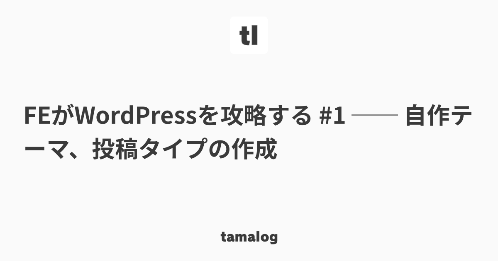

[Qiita](https://qiita.com/)や[Zenn](https://zenn.dev/)などのサービスでは、記事のシェア時に表示されるOGP画像にタイトルの文言などが表示されます。これをこのブログでも実装してみました。

## ライブラリの導入とカスタマイズ

[catchy-image](https://github.com/kentaro-m/catchy-image)というライブラリを使用しています。Gatsbyでの利用方法も[作者さんのページ](https://blog.kentarom.com/create-gatsbyjs-plugin-to-dynamically-generate-og-images/)に書かれているので、正直ここに書くほどの内容はあまりないですが……。

ちょっとしたオリジナリティを出すために、`gatsby-config.js`では下記のような設定を行いました。

```javascript
// ...
{
  resolve: `gatsby-remark-og-image`,
  options: {
    output: {
      directory: '',
      fileName: 'og_dynamic.png',
    },
    image: {
      width: 1200,
      height: 630,
      backgroundImage: require.resolve('./src/images/og_dynamic.png'),
    },
    style: {
      title: {
        fontFamily: 'Noto Sans JP',
        fontColor: '#3a3a3a',
        fontWeight: 'bold',
        fontSize: 56,
        paddingTop: 0,
        paddingBottom: 0,
        paddingLeft: 56,
        paddingRight: 56,
      },
      author: {
        fontFamily: 'Noto Sans JP',
        fontColor: '#3a3a3a',
        fontWeight: 'bold',
        fontSize: 16,
      },
    },
    meta: {
      title: '',
      author: '',
    },
    fontFile: [
      {
        path: require.resolve('./src/styles/NotoSansJP-Bold.otf'),
        family: 'Noto Sans JP',
        weight: 'bold',
      },
    ],
    // 執筆者アイコンを非表示とするため、ダミーとして1pxの透過pngを読み込んでいる
    iconFile: require.resolve('./src/images/dummy.png'),
    timeout: 10000,
  },
},
// ...
```

このライブラリでは執筆者のアイコンと名前を表示できますが、見る限り非表示の設定がなさそうだったので「1pxの透過アイコン」と「空文字」で対応し、タイトルのみが表示されるよう設定しました。ブログのロゴといったデザイン自体は画像として作成し、`backgroundImage`として読み込んでいます。



`gatsby build`を叩いたタイミングで、こんな感じの画像が自動生成されるようになりました。
