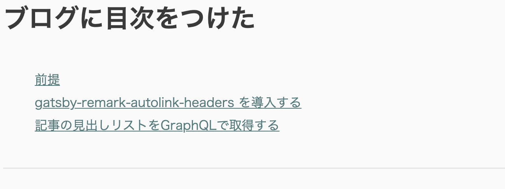

Gatsbyでの目次のつけかたは各所で紹介されており、特に目新しい内容はありませんがメモ。
かなりお手軽です。

## 前提

- `gatsby-transformer-remark`を利用していること

## gatsby-remark-autolink-headers を導入する

```
yarn add gatsby-remark-autolink-headers
```

これは[公式](https://www.gatsbyjs.com/plugins/gatsby-remark-autolink-headers/)で提供されているプラグインで、「Markdown記事内の各`h`タグにidを付与してくれる」というものです。

注意点として、このブログも該当しますがシンタックスハイライトの`gatsby-remark-prismjs`を導入している場合は「`gatsby-config.js`上で**先に**`gatsby-remark-autolink-headers`のほうを読み込む」ことが必要です。

```js
{
  resolve: `gatsby-transformer-remark`,
  options: {
    plugins: [
      // ...
      `gatsby-remark-autolink-headers`,
      `gatsby-remark-prismjs`,
      // ...
    ],
  },
},
```

## 記事の見出しリストをGraphQLで取得する

`gatsby-transformer-remark`は標準で記事内に`h`タグを`ol`タグのリストとして取得する機能を持っています。便利！

見出しを取得したいページのクエリに`tableOfContents`という項目を追加します。

- blog-post.tsx

```js
export const pageQuery = graphql`
  query BlogPost($id: String!) {
    site {
      siteMetadata {
        url
      }
    }
    markdownRemark(id: { eq: $id }) {
      id
      excerpt(pruneLength: 160)
      html
      tableOfContents // ←ココを追加
      frontmatter {
        title
        date
        tags
        thumbnail {
          childImageSharp {
            gatsbyImageData
          }
        }
      }
    }
  }
`;
```

あとは、この`tableOfContents`の内容をそのままHTMLとして出力してあげるだけです。

```jsx
<div
  dangerouslySetInnerHTML={{
    __html: post.tableOfContents || '',
  }}
  className={styles.tocInner}
/>
```

お好みでスタイルを付与すれば完成です。
参考までに、この記事の目次は以下のように出力されています。


