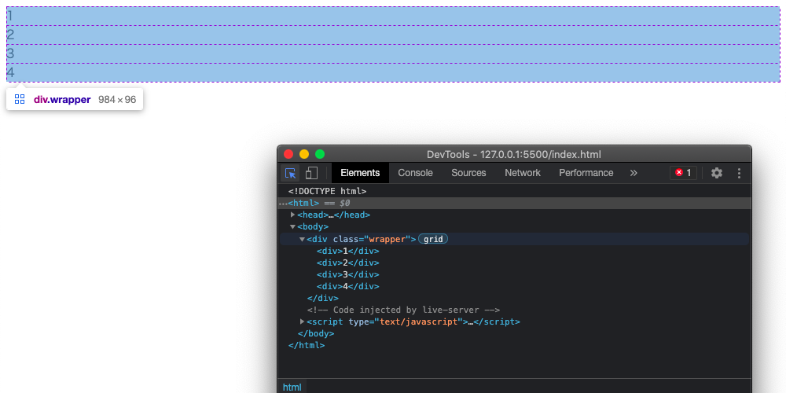
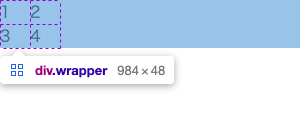
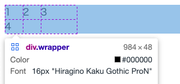
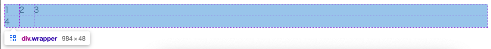
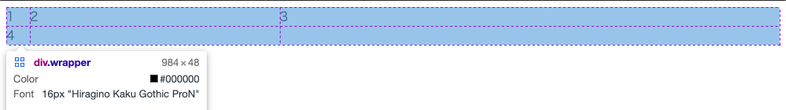
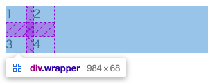
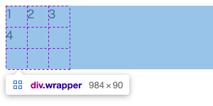
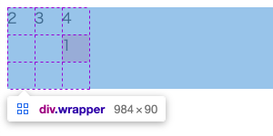
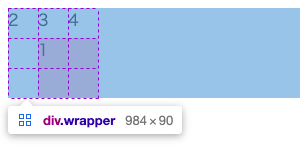

恥ずかしながらdisplay: gridをほぼ使ったことがなかったのですが、ブログの記事一覧をレイアウトする際にとても便利だったので、この機会に使い方をおさらいしてみます。

詳細な解説は[MDN](https://developer.mozilla.org/ja/docs/Web/CSS/grid)や既存の記事がたくさんあるので、ここでは手っ取り早く利用するためのごく初歩的な内容に絞って解説していきます。

## gridコンテナを作る

```html
<div class="wrapper">
  <div class="item1">1</div>
  <div class="item2">2</div>
  <div class="item3">3</div>
  <div class="item4">4</div>
</div>
```

```css
.wrapper {
  display: grid;
}
```



display: gridを指定した要素は**gridコンテナ**となります。display: flexのコンテナと考え方は同じで、この要素の子要素（gridアイテム）はgridの設定にしたがって配置されます。

## 縦横のグリッド幅を指定する

`grid-template-rows` および `grid-template-columns`を用いることで、グリッドの縦横のサイズを指定することができます。

ここでは`grid-template-columns`で列の指定をしてみます。

```css
.wrapper {
  display: grid;
  grid-template-columns: 30px 30px;
}
```



30pxの列が2つ作成されて、アイテムがグリッドに沿って配置されました。このとき、**渡した数値の個数に応じて列数が変わる**のがポイント。

たとえば`30px 30px 60px`なら、30pxの列2つと60pxの列1つが作成されます。



## fr で要素幅を指定する

gridレイアウト用の新たな単位として`fr`があります。少しややこしいので実際の挙動を見ていきます。

```css
.wrapper {
  display: grid;
  grid-template-columns: 30px 30px 1fr;
}
```



30pxの列が2つ + **gridコンテナの残りの横幅**の列が作成されます。

```css
.wrapper {
  display: grid;
  grid-template-columns: 30px 1fr 2fr;
}
```



上記の設定では、30pxの列が1つ + **残りの横幅の1/3の列、2/3の列**が作成されます。

`fr`の挙動は「（絶対値で指定されたグリッドを除く）gridコンテナの全体幅を分割してサイズ指定を行う」というイメージです。この機能はレスポンシブなページ作成をする上で役立ちます。

## gap で要素の間隔を指定する

作成したグリッドの間隔を指定することもできます。いちいち`margin`をつけたりしなくてよいのでとても便利です。

```css
.wrapper {
  display: grid;
  grid-template-columns: 30px 30px;
  gap: 20px 10px;
}
```



## repeat を使う

30pxの列を8本作りたいとき、

```css
.wrapper {
  display: grid;
  grid-template-columns: 30px 30px 30px 30px 30px 30px 30px 30px;
}
```

と書くのはさすがに冗長ですが、

```css
.wrapper {
  display: grid;
  grid-template-columns: repeat(8, 30px);
}
```

と書けます。また、gridコンテナの幅に応じて列数を変更したいときは

```css
.wrapper {
  display: grid;
  grid-template-columns: repeat(auto-fit, 30px);
}
```

と指定すればOK。`flex`で段落ちを実現する場合`flex-wrap`の指定を行う必要がありますが、要素間の縦横マージンの設定が面倒。`grid`であれば`gap`のとおり余白が取られるのでとてもラクです。

## アイテムの配置位置を指定する

display: gridでは作成したグリッドのどこに要素を当てはめるかを指定することができます。

```css
.wrapper {
  display: grid;
  grid-template-rows: repeat(3, 30px);
  grid-template-columns: repeat(3, 30px);
}
```



例として、3x3の碁盤状のグリッドを作成してみました。デフォルトではHTMLの基本的な挙動通り「左上から順に」配置されていることがわかります。ここに要素を自由に配置していきます。

アイテム側に、`grid-row`と`grid-column`を指定してみましょう。

```css
.item1 {
  grid-row: 2;
  grid-column: 3;
  background: pink;
}
```



これだけで、「2行3列目に`item1`を配置」することが可能です。さらに、範囲指定もできます。

```css
.item1 {
  grid-row: 2 / 4;
  grid-column: 2 / 4;
  background: pink;
}
```



2行2列目の開始〜4行4列目の開始（=3行3列目の終端まで）がitem1の領域となりました。3行3列目を範囲に含める場合に、`2 / 3`という指定ではない点に注意です。

## おわりに

ごく基本的な機能に絞って紹介しましたが、これだけでも従来のHTMLレイアウトよりもかなり柔軟に配置を行えることがわかりました。

ちなみに`grid`はIE11に**完全非対応ではない**のですが、一部使えないプロパティや必要なprefixがあります。早くIEのことを一切考えずにコードを書ける時代がきてほしいですね。なお、このブログは趣味で作成しているので、IE11のことをまったく考慮していません……。
