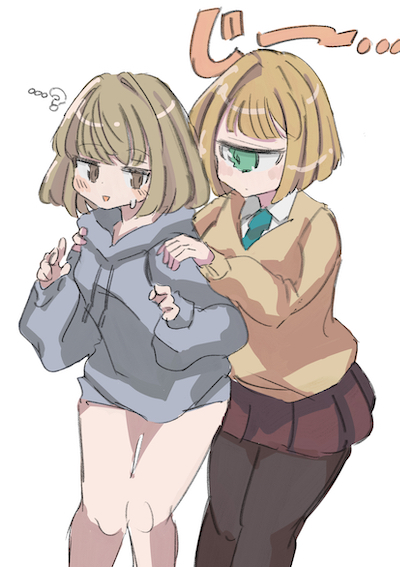
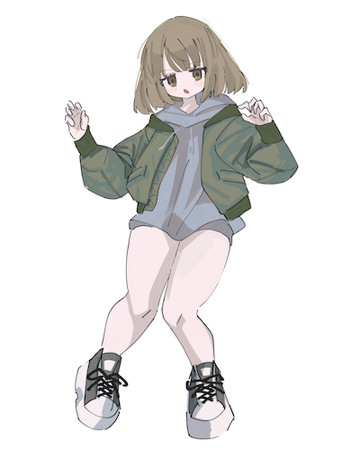
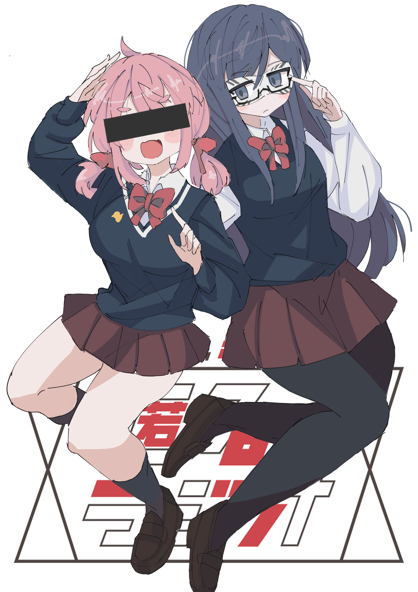

**死んでいました。**

業務が忙しいとかそういう言い訳は脇においておくとして、またぼちぼち書いていきたいと思います。

ところでこのブログはもともと「である調」で書いていたのですが、どうも性に合わない気がしてムズムズしていたので、今回から「ですます調」にします。なんとなく気になったので過去記事もざっくり書き換えました。

## 先月の達成状況

- **一切のルールを設けずに**落書きを4枚ほど書いた。

### 成果、気付き

- 2020年11月〜12月はほとんどイラストを描いていなかったので、リハビリとして気楽に描きました。
- これがむしろ効果的だったのか、**しばらく練習していないのに自分の中では調子がよかった**です。楽しく描くことは何よりも大事。
- もともと継続が得意な方ではないので、間隔が空いたことをネガティブに捉えず「めちゃくちゃ楽しく描ける時期が戻ってきた」くらいの気持ちで行こうと思います。
- 匿名ラジオは作業用BGMに最適。と言いつつ、オモコロのラジオで一番好きなのは「ありっちゃありスパーク」です。

## 2月の目標

- すっかりモチベーションが回復したので、また3、4枚のイラストは描きたいです。
- 基礎練習も再開しようと思います。最近は特に「手」の魅力的なイラストにとても惹かれるので、苦手な「手」にも向き合いたいです。
- プログラミング記事でも雑記でも、何でもいいからもっとラフに運用したい気持ちが出てきました。
