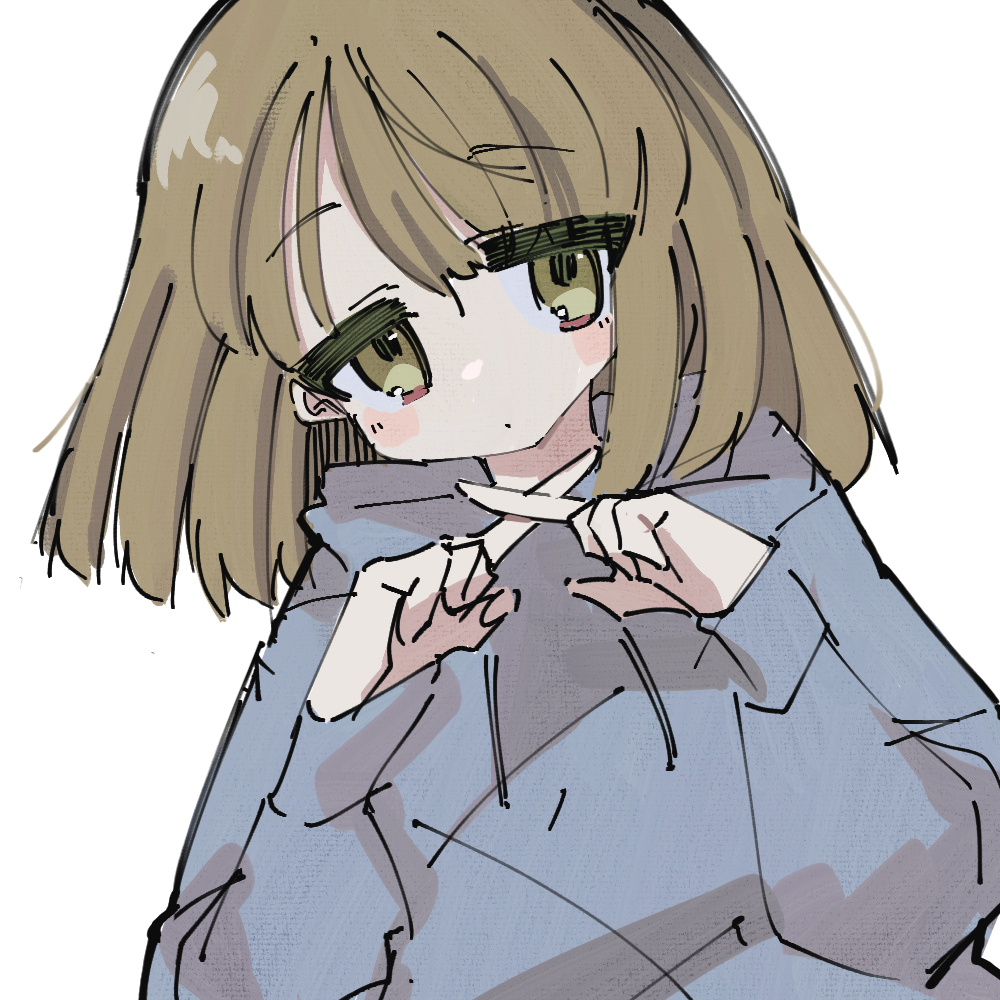
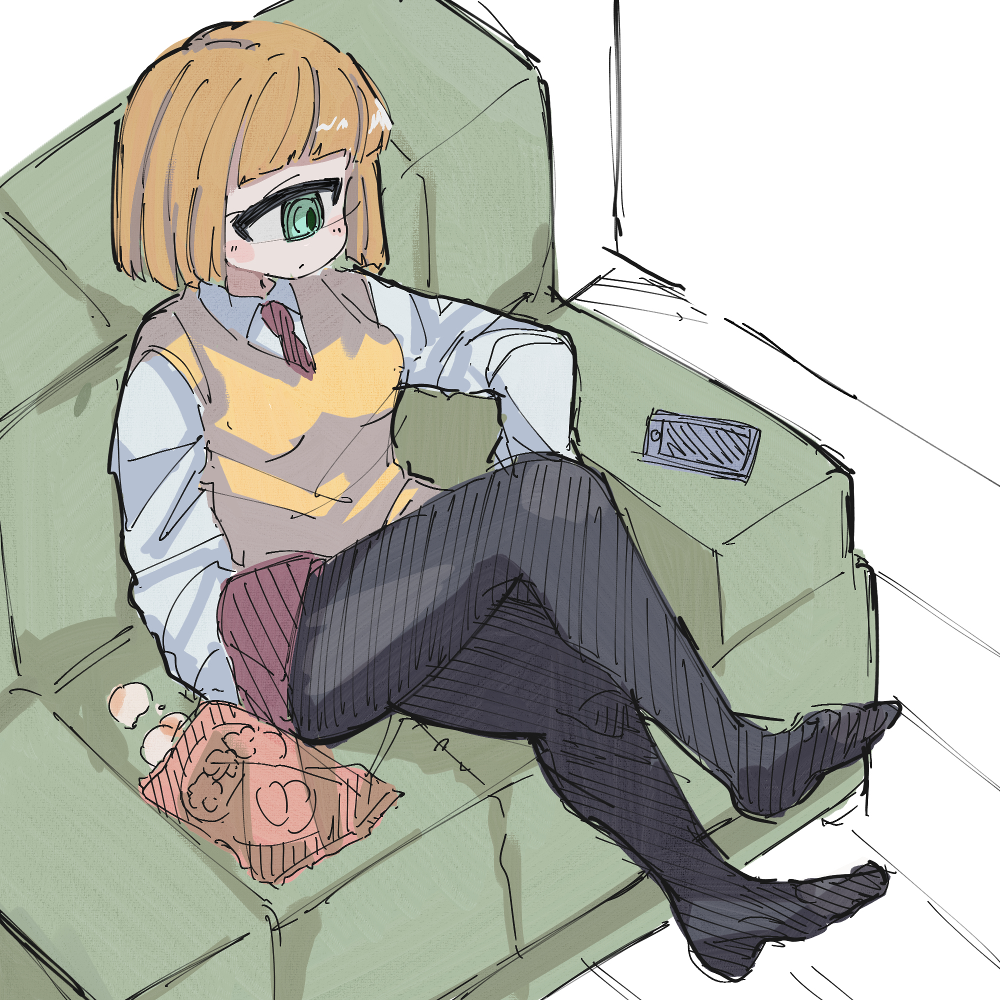
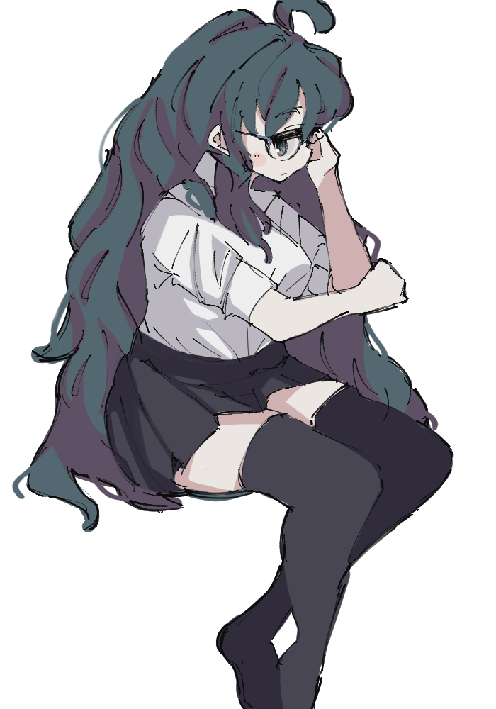
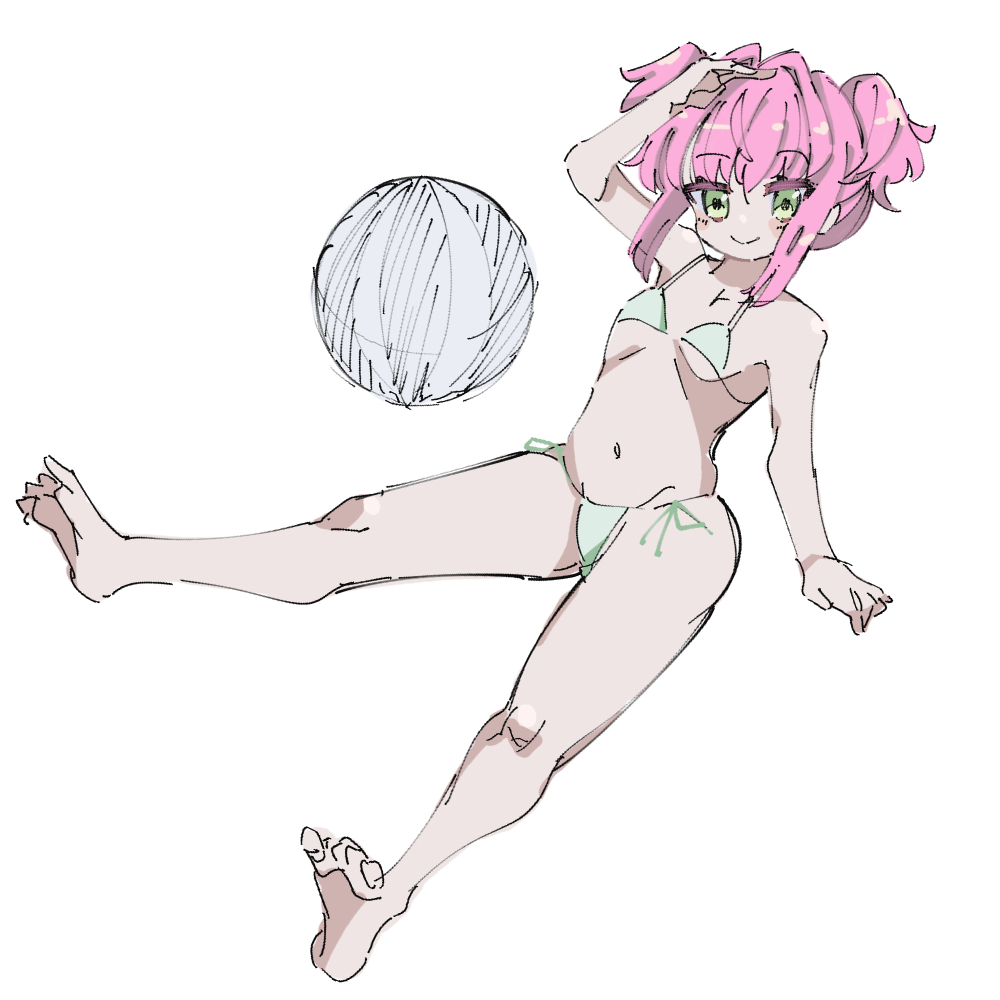

プライベートがちょっと落ち着いたので久々に。

## 先月の達成状況

- 特になにも考えず落書きをたくさん描いた。

### 成果、気付き

- とにかく楽しかったです。
- 普段より小さめのキャンバスにガシガシ描いていました。線がそこまで綺麗でなくとも見栄えするので、手軽に描きたいときはよいと思いました。
- [令和のお絵かき掲示板](http://kuro.kilo.jp/obbs/index.html)が最高。いつまでも見ていられます。お絵かき掲示板っていいよね、、

## 今後の目標

- しばらくそこまで多忙にならない予定なので、時間を見つけて描いていきたいです。
