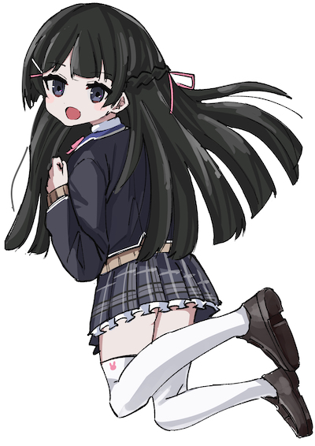
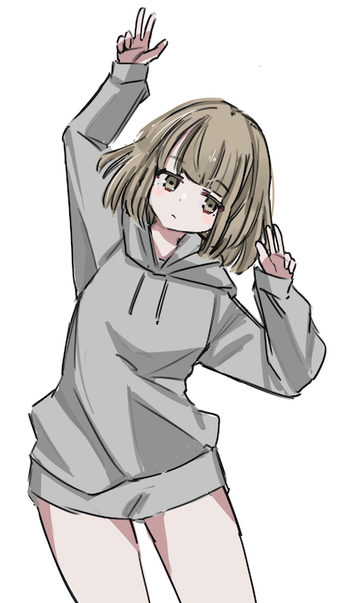
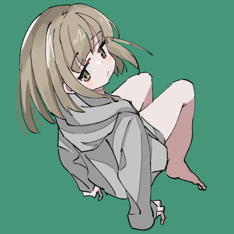

- **もうとっくに9月。** この記事では8月に取り組んだ内容のみを記載します。

## 今月の達成状況

- 模写中心に基礎練習を行った。人物写真では[「だらっとしたポーズカタログ3」](https://www.maar.com/shop/comic/pose/%E3%81%A0%E3%82%89%E3%81%A3%E3%81%A8%E3%81%97%E3%81%9F%E3%83%9D%E3%83%BC%E3%82%BA%E3%82%AB%E3%82%BF%E3%83%AD%E3%82%B0%EF%BC%93)、イラストでは[「人間よ強欲であれ」](https://www.amazon.co.jp/%E6%9C%9B%E6%9C%88%E3%81%91%E3%81%84%E7%94%BB%E9%9B%86-%E4%BA%BA%E9%96%93%E3%82%88%E5%BC%B7%E6%AC%B2%E3%81%A7%E3%81%82%E3%82%8C-%E6%9C%9B%E6%9C%88-%E3%81%91%E3%81%84/dp/4758017328)、[「吉成曜画集 ラクガキ編」](https://www.amazon.co.jp/%E5%90%89%E6%88%90%E6%9B%9C%E7%94%BB%E9%9B%86-%E3%83%A9%E3%82%AF%E3%82%AC%E3%82%AD%E7%B7%A8-%E5%90%89%E6%88%90%E6%9B%9C/dp/4902948192/ref=sr_1_2?adgrpid=103695531242&dchild=1&gclid=Cj0KCQjwm9yJBhDTARIsABKIcGa5zJUDL_uBx84OSG2fwRghnTNpKo4CZQFblduQHU6a9CMgieEK5UcaAmt0EALw_wcB&hvadid=439536735546&hvdev=c&hvlocphy=1009311&hvnetw=g&hvqmt=e&hvrand=6033868991053303108&hvtargid=kwd-937882727514&hydadcr=20663_9370561&jp-ad-ap=0&keywords=%E5%90%89%E6%88%90%E6%9B%9C%E7%94%BB%E9%9B%86%E3%83%A9%E3%82%AF%E3%82%AC%E3%82%AD%E7%B7%A8&qid=1631067887&sr=8-2)を購入して参考にした。
- イラストを4枚描いた。

## 成果、気付き

- 4枚目のイラスト(オリジナルキャラクター)では多少挑戦的な構図を試し、ある程度納得のいく成果が出せました。

- 「構図やイラストの構成力がない」という明確なウィークポイントを抱えているため、「イラストの模写」はかなり高い威力を発揮しました。シルエットを掴む力をつけたいのか、構図力を上げたいのか……といった目的に応じて適切なリファレンスは変わるようです。できるだけ惰性にならないよう、目的意識を持って練習を続けたいです。

- 「絵柄の方向性を定めること」の難しさを感じました。
- 少しずつ過去の絵柄よりも頭身を上げようと意識しているのですが、デフォルメのきいた絵柄も好きなので、やりたいことがブレてしまうときがあります。この試行錯誤がオリジナリティにつながるのだろうか。

## 課題

- 「塗り」にあまり気を回せていません。光源などを意識した魅力的な塗りにチャレンジしたいです。
- 改善の糸口が見えつつありますが、ポーズや構図の単調さは依然として課題です。

## 9月の目標

- 基礎練習とアウトプットをストイックに継続します。

- **とにかく写真やイラストの模写を繰り返す**練習法はかなり効果的なようで、明らかに「シルエットを取るのがうまくなった」「ポーズの幅が広くなった」などの好影響が出ています。

- 「何を達成するための練習なのか」を意識することも大切ですが、イラストは自分の思っている以上にフィジカルな行為であり「**結局は練習の『量』**」という側面もありそうです。

- というわけで、「つべこべ言わず手を動かす」9月にしていきたいです。
