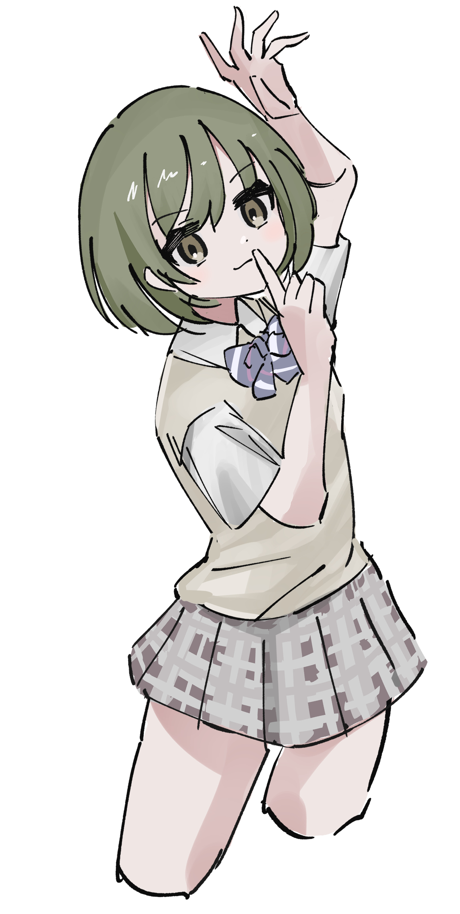
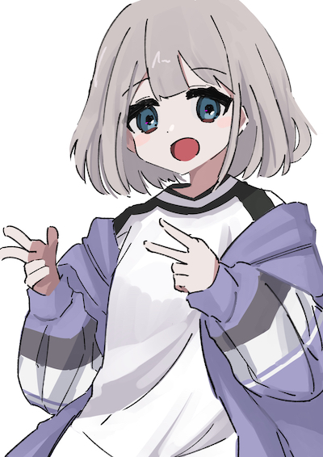
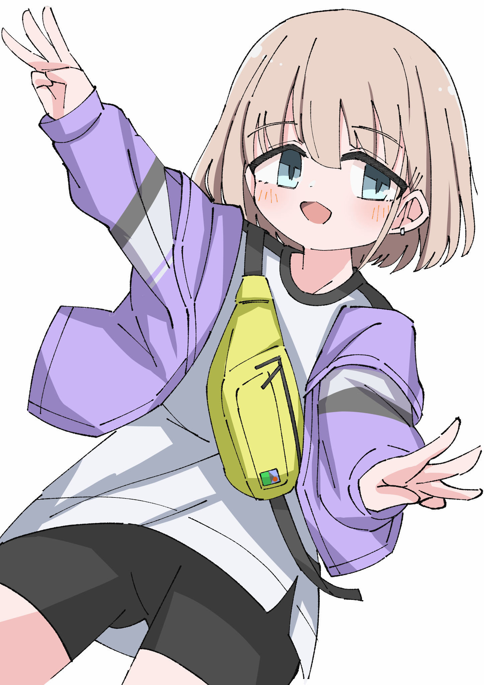

ちょっと忙しく練習の総量は減ってしまった……という言い訳。そのぶん効果的に練習できるように意識はしていました。

## 今月の達成状況

- 今月から、かの有名な「[3ヶ月上達法](https://www.youtube.com/watch?v=lRmgLBCaV6Q)」の考え方を取り入れてみる。
- 「3ヶ月上達法」で出た課題に対する具体的な練習として「好きなイラストの模写」「服を着た人物写真の模写」「[ポージングチュートリアル](https://www.maar.com/shop/comic/comic-howto/isbn9784837308164)」をいくつかやった。
- イラストを4枚描いた(落書きレベルのものは除く)。

## 成果、気付き

なるべく一つでも「課題に対する挑戦」を盛り込みながらアウトプットするように心がけました。ただし、「◯◯しなければならない」と意識しすぎるとアウトプットの心理的なハードルが上がってしまう側面も感じました。肩の力を抜いたほうが成果物の完成度が高くなることも多いので、楽しみながら進めていきたいです。

ちなみに上に載せた4枚目のイラストは今月末に描いたもので、下記は本格的な絵の練習を始めて間もない4月4日に描いたもの(どちらも「アイドルマスター」の芹沢あさひ)。多少は前進しているのでは……！

## 課題

6月後半に感じていた不調は脱した、というか「何がうまくいっていないのか」が具体化してきた気がします。特に気になっているのは

- 構図の想像力がない、資料に依存しすぎてアレンジが加えられない
- 線を引く能力が低く、線画が気に入らない

というところ。これらは一朝一夕で伸びるような部分でもないので、ひたすら経験を積んでいくしかないのだと思います。

## 8月の目標

とにかく3ヶ月上達法を高精度で継続すること。

1ヶ月続けてみて感じたのは、たとえば「塗りがイケてない」という課題が見えてきたときに、それを解消するための練習法を考えることがけっこう難しいことです。とはいえ、そこを意識してひたすら地道に模写するしかない、という気もします。まずは量だ。
