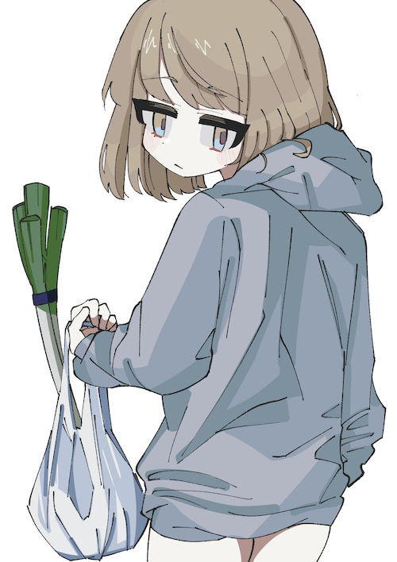
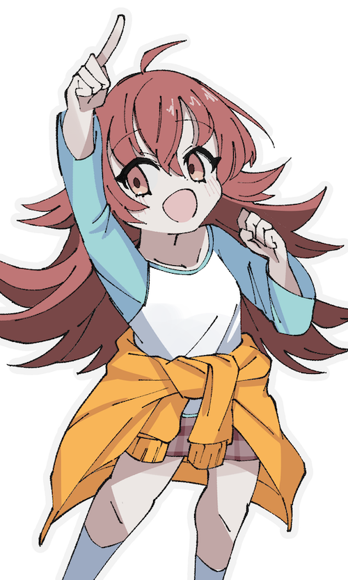
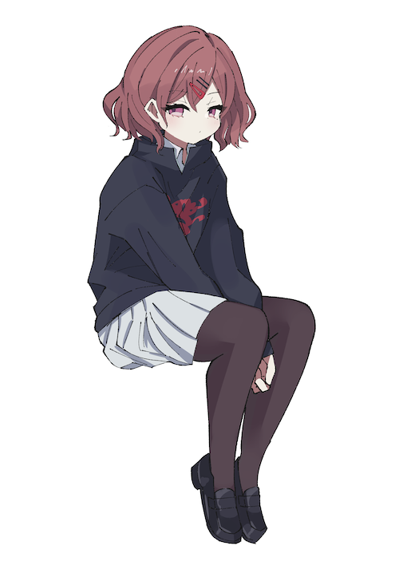

とりあえず続けてはいるが、手段が目的化しないように少しずつ練習の「質」を高めることも意識したいところ。

## 今月の達成状況

- 基礎練習としてモルフォ人体デッサンを継続し、とりあえず1周した。
- イラストを4枚描いた。

## 成果、気付き

今月はイラストを描く際になるべく写真資料を参照するように努めた。服のシワなどは、可能な限り描きたいものに類似する資料をきちんと集めることで、ある程度のリアリティを出せると感じた。この意識は続けていきたい。

## 課題

今月後半から調子が悪く、思い通りに描けない状況が続く。考えられる原因は以下。

- クロッキーで多少の人体知識を得たことで、「なんとなく」の描き方（手癖）が通用しなくなってきた。
- 「イラストとして」魅力のある構図、ポーズの想像力や知識がない。
- 顔の描き方などのセオリーがわからず、試行錯誤と偶然に頼っている。
- 理想が高すぎる。

## 7月の目標

上記の課題を解決するには「好きなイラストの模写」が有効だと考えた。たとえば

- どのようにデフォルメを行えばよいのか
- 魅力的なポーズはどう描くか

といった情報はリアルな人体のクロッキーだけでは得られないため、これをイラストの模写によって補完していきたい。

7月からは、

- 好きなイラストの模写による、デフォルメやポーズ、構図の研究
- 衣服を着ているなど、より現実に即した人物写真の模写

を基礎練習として行う予定。どうにか不調を脱し、アウトプットも3, 4枚は最低でも出したい。
