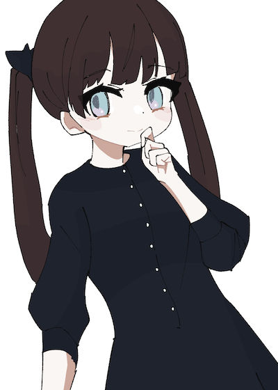

今月もスキマ時間でぼちぼち描いています。

## 今月の達成状況

- [モルフォ人体デッサン](http://www.graphicsha.co.jp/detail.html?p=34678)を進めました。本の進度としては全体の1/3程度。
- いくつかのイラストを描きました。

### 成果、気付き

- 上手な作家のイラストを参考にしながら色を置いてみることで、「肌色はこういう色だ」といった固定観念が覆されました。もっと自分の中で理屈をもって色を作ったり選択することができるようになりたいです。
- 今月はある程度意識的に、背景や複雑な構図などには手を出さず「立ち構図や自然なポーズでバリエーションを出す」ことを優先しました。しかし、イラストとして魅力のあるものが描けなかった気もするので、シチュエーションやポージングの表現を磨いていく必要があると感じます。

## 6月の目標

- 5月中旬からTwitterに習作の毎日投稿を続けています。毎日となると難しい日もあるかもしれないが、可能な限り高頻度で投稿することでモチベーションを維持していきたいです。
- 「モルフォ」の続きをやる。「[ソッカ](https://www.ohmsha.co.jp/book/9784274507151/)」で学んだ知識と組み合わせて理解を深めていきます。
- もう少し複雑な構図やちょっとした背景を含むストーリー性のあるイラストに挑戦してみます。
