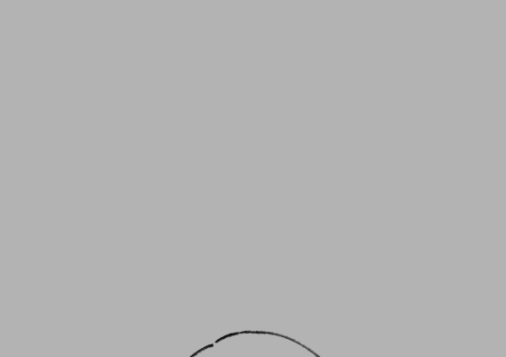

- 粛々と続けています。

## 今月の達成状況

- 写真、イラストの模写、クロッキーなどを雑多にやりました(40ページ弱)。
- イラストを3枚、ショートアニメを2つ描きました。
- ショートアニメは「[ラグトレイン](https://www.youtube.com/watch?v=UnIhRpIT7nc&vl=ja)」のMVパロディ。トレースはせずに描いています。

## 成果、気付き

- GIFアニメを作るのは思いのほか面白いです。気分転換としてたまに挑戦したい。
- 最後のイラストは**3ヶ月上達法**の総決算として描いたもの。7月よりは進歩していると思うが、やり方次第でもっと上達できた気もします。
- 今月はあえて「量」優先で自由に練習を行ってみました。当然「課題」は膨大にあるため、そのすべてに対応しようとして中途半端になってしまったかもしれないです。

## 課題

- 「自分には何が必要で、どう練習すべきか」は以前に比べると見えてきていますが、練習時はある程度優先順位をつけて絞り込みながら練習していく必要がありそうです。「全部ダメ」と言ってしまうのは簡単ですが……。

## 10月の目標

- 上記を踏まえ、3ヶ月上達法の「2巡目」を開始します。
- 作品を作る際に、挑戦する課題の範囲を**なるべく狭くする**ことを意識し、それに特化した練習を進めていきたいです。
