ふと思い立ち、私のエンジニアとしてのプロフィールを記載した[ポートフォリオ](https://szmd.jp/)を作りました。3D表現をかわいく作れたので気に入っています。

今回は、Next.jsとヘッドレスCMSの[Contentful](https://www.contentful.com/)を組み合わせて、お手軽にコンテンツを更新できるポートフォリオの作成方法を紹介します。

※備忘録的な趣が強いので、解説テンポはやや速めです。

3D表現に関する内容（Three.js や react-three-fiber）もいずれ記事にする予定ですが、今回は特に触れません。

## 環境

- Next.js 12.1.5
- TypeScript 4.6.3
- Contentful 無料版
- Vercel

基本的な環境のセットアップとVercelへのホスティングが完了しており、Next.jsの`getStaticProps`などの機能は理解している前提の記事となります。

Next.jsの基礎について解説した[過去記事](../next-markdown-blog/)もあるので、よければ読んでみてください。

## そもそもContentfulって何？

Contentfulは「API-first content platform」と公式で謳われているとおり、Viewを持たずAPIによってデータ取得を行えるように作られたCMSです。

コンテンツの管理はContentful上で行い、ViewはReactなどを利用して作ることができるため、フロントエンドエンジニアには特に適しています。

無料版にはいくつか機能制限がありますが、個人利用には十分です。

なお、私は業務でもContentfulを用いた開発経験がありますが、商用目的の大規模なサイト制作を行う場合には、有料のEnterpriseプランを選択することもできます。

## Contentfulのスペースを作成する

それでは、さっそく使ってみましょう。

アカウントを持っていない方は、[公式サイト](https://www.contentful.com/)から作成しましょう。

スペースの作成は特に難しい内容はないので、詳細は割愛します。

以下は個人のOrganization上に「szmd」（※私のポートフォリオのタイトル）という名前でスペースを作成した例です。複数のサイトでContentfulを利用する場合は、スペースを追加することもできます。

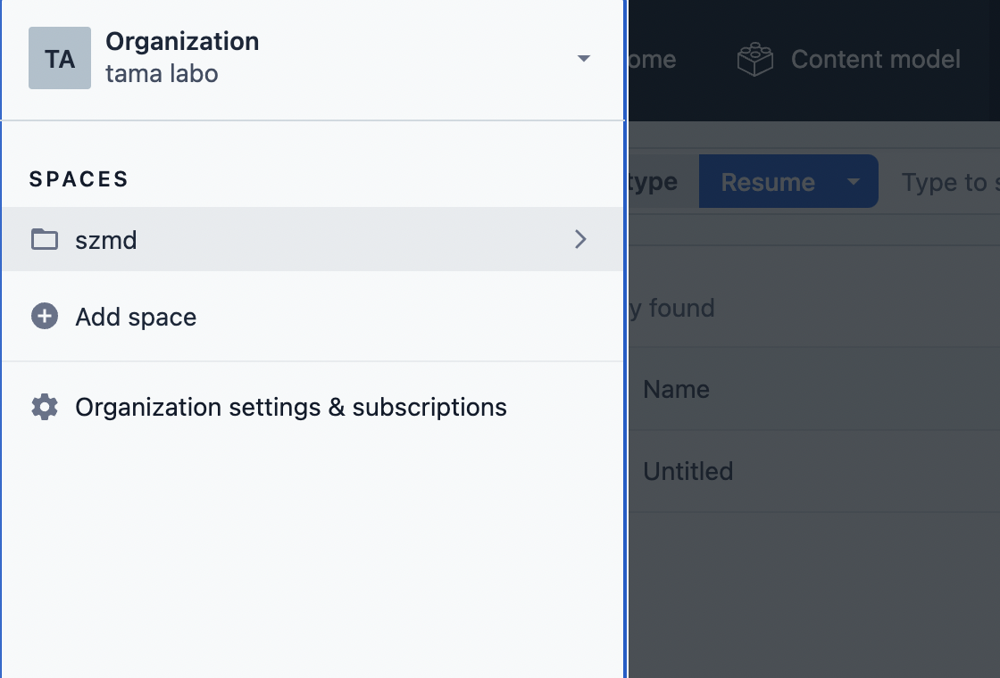

## コンテンツモデル

Contentfulは、コンテンツにどのようなデータ構造を持たせるかを柔軟にカスタマイズできるようになっており、そのデータ構造を「コンテンツモデル」と呼びます。

今回のポートフォリオでは、それぞれのコンテンツに対して

- [プロフィール](https://szmd.jp/profile/): 本文テキストのみ
- [職務経歴](https://szmd.jp/resume/): 本文テキストのみ
- [つくったもの](https://szmd.jp/works/): 「タイトル、リンク先URL、サムネイル、本文テキスト」を持つデータを複数個並べる

というシンプルなコンテンツモデルを作成して管理することにします。

### コンテンツモデルを作成する

画面上部の「Content Model」→「Add Content Type」からコンテンツモデルの追加ができます。

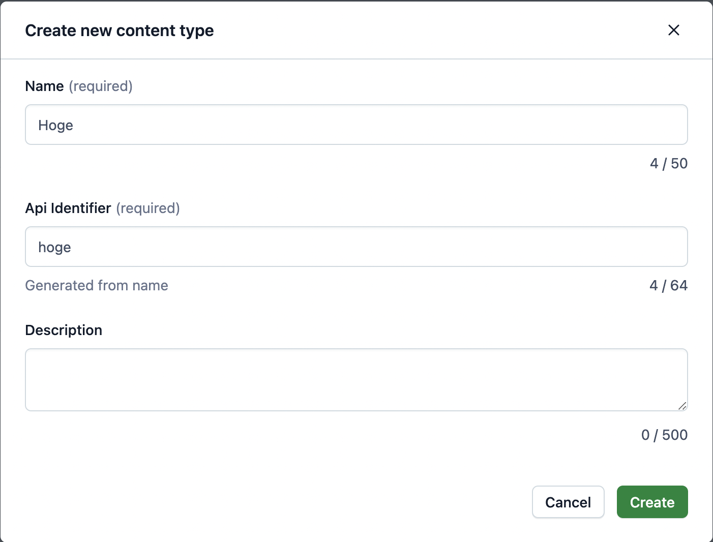

続けて表示されるコンテンツモデルの編集画面で「Add Field」を選択すると、様々なデータ型から選択して「フィールド」を追加できます。

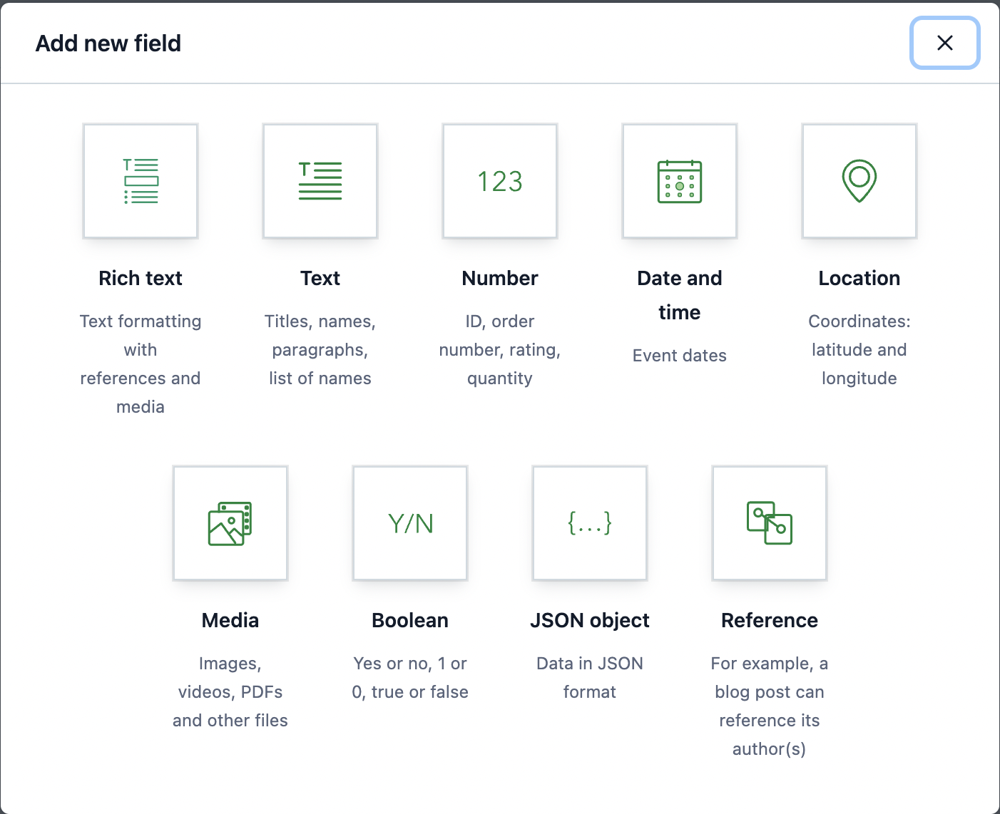

以下は実際にコンテンツモデルをそれぞれ設定した例です。

### プロフィール

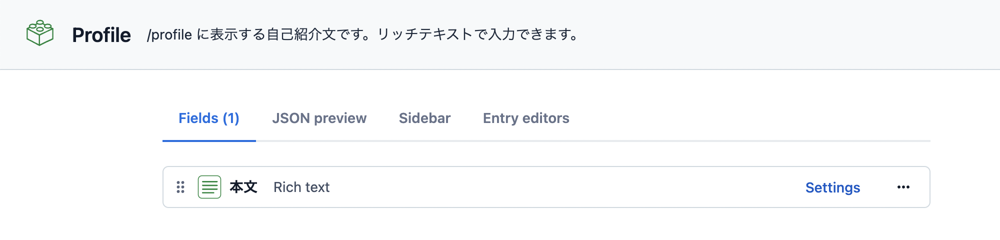

### 職務経歴

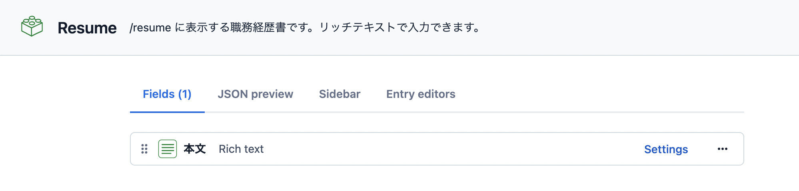

### つくったもの

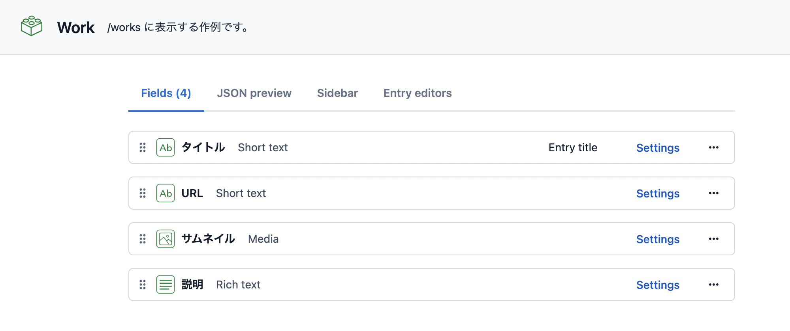

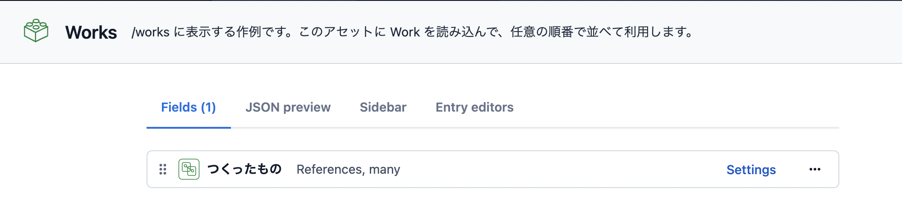

Contentfulの大きな特徴として、「Reference」というフィールドを利用することで **「他のコンテンツモデルを参照」** する入れ子構造のコンテンツを作成できる点が挙げられます。

ここでは、「タイトル、リンク先URL、サムネイル、本文テキスト」という構成のコンテンツモデル「Work」を、任意の数だけコンテンツモデル「Works」で参照できるようにしています。

こうすることで、複数の「つくったもの」をContentful上で自由に追加したり、並び替えできるようになります。

最終的には、以下のように4種類のコンテンツモデルを作成しています。

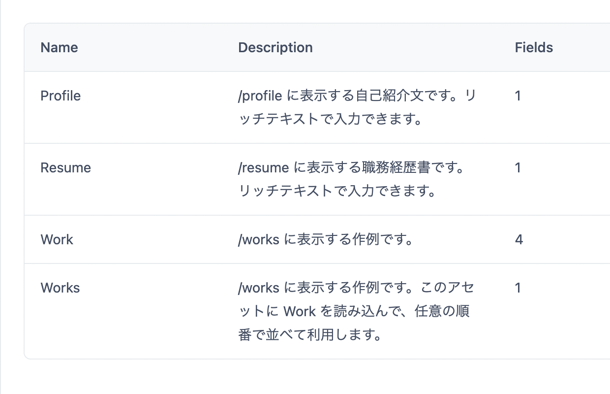

## コンテンツを追加する

画面上部の「Content」から、先ほど作成したコンテンツモデルに倣う形式で実際のコンテンツを追加、編集することができます。

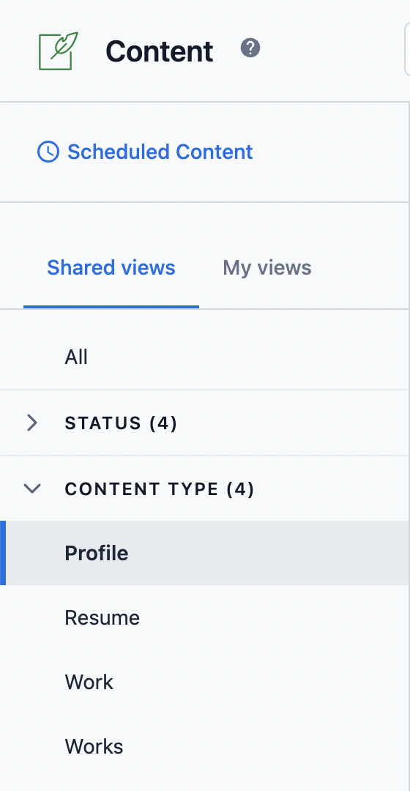

画面左の「CONTENT TYPE」には、先ほど作成した4種類のコンテンツモデルが表示されています。コンテンツタイプを選択→画面右上「Add」を選択すると、実際にコンテンツを追加することができます。

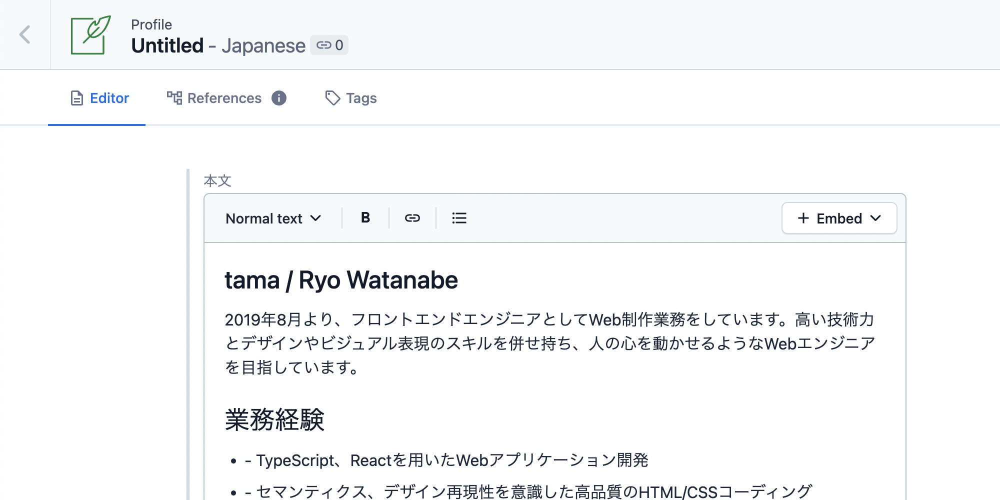

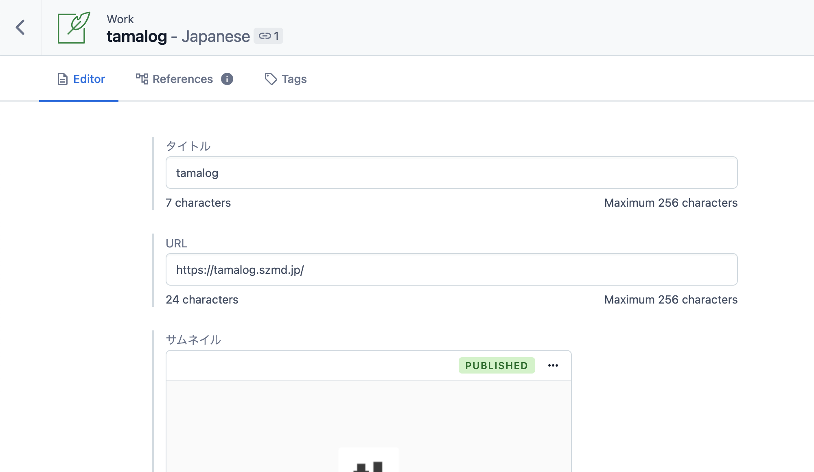

コンテンツモデルを設定したとおりに、「Profile」と「Resume」にはリッチテキストの入力欄のみが、「Work」には4つの入力欄が表示されています。

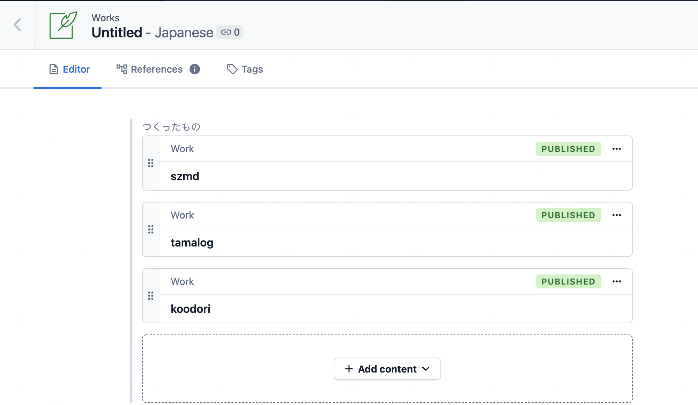

そして最後の「Works」では、あらかじめ登録した「Work」のコンテンツを読み込んで追加、並び替えができるようになっています。

なお、編集後は「Publish」を選択してコンテンツの公開を行わないと、ContentfulのAPIが送信するデータには反映されないため注意しましょう。

## 各種IDの確認、アクセストークンの発行

続いて、Contentfulにアクセスするために必要になるIDの確認やトークンの発行を行います。
画面上部のメニュー「Settings」→「API Keys」を選択しましょう。

### コンテンツ取得用のアクセストークン

「API Keys」を開くと最初に表示される「Content delivery / preview tokens」タブから、「Add Key」で任意の名前をつけたトークンを発行します。私はわかりやすく「Next.js」としました。

トークンは後ほど環境変数として登録するので、手元に控えておきましょう。

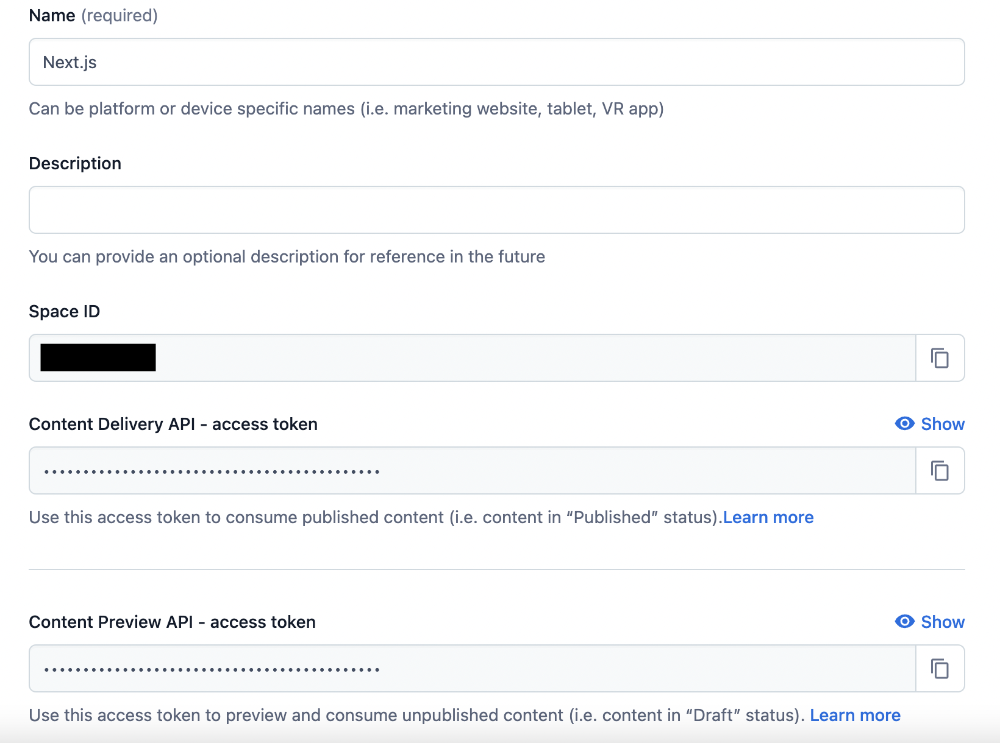

| 名前 | 解説 |
| - | - |
| Space ID | 作成したスペースのID |
| Content Delivery API | 「Publish」したエントリを取得できるAPI（本番環境用） |
| Content Preview API | 公開済のエントリだけでなく、「Draft（下書き）」の状態のエントリも取得できるAPI。プレビュー環境を作成する場合に利用できますが、本記事では使いません |

### 管理用のアクセストークン

続いて、コンテンツ取得以外の管理権限を持たせることができるトークンを「Content management tokens」タブから作成します。

今回は、「Contentfulのコンテンツモデルに合わせて自動的にTypeScriptの型生成を行う」ためにこのトークンを利用します（詳細は、後編記事で解説します）。

### 各エントリのIDを確認する

今回、私のポートフォリオでは「自己紹介」「プロフィール」「職務経歴」「つくったもの」という3種のエントリを単体でそれぞれ読み込んで利用する方針をとっています。そのため、各エントリの編集画面右に表示されている「ENTRY ID」を控えておきます。

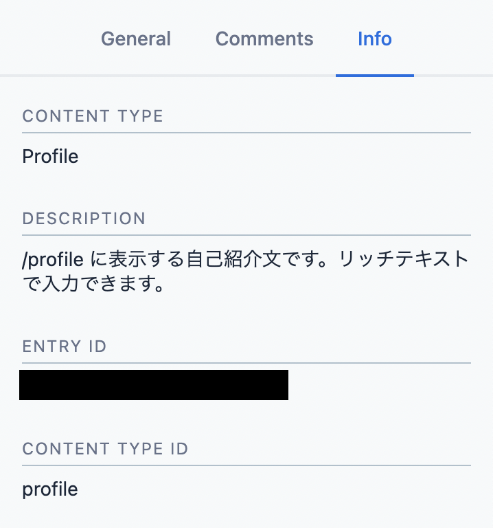

※ブログサービスを作る際など、「同一のコンテンツモデルを持つ複数エントリをまとめて読み込む」といった操作をする際は、この手順は不要です。

## 次回予告

本記事ではContentfulの事前準備だけで終わってしまいましたが、次回はこれらのコンテンツをNext.jsから読み取って表示するまでを実践したいと思います。

Contentfulで取得したデータの型定義など、TypeScript環境向けの内容も解説します！
