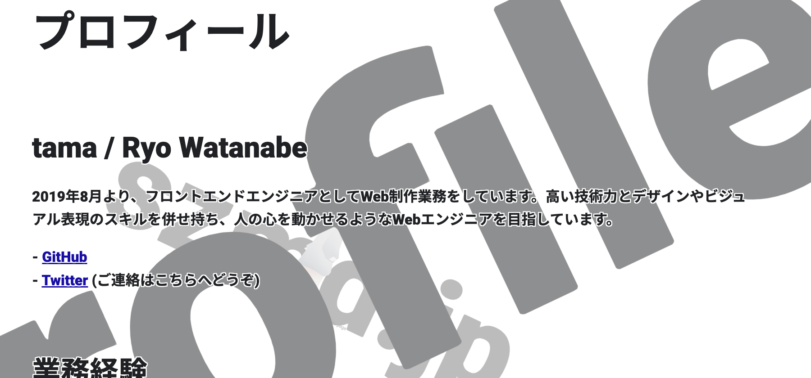
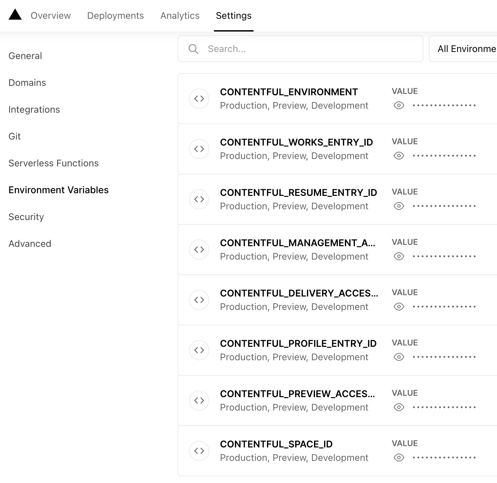
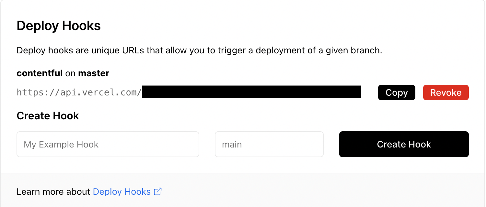
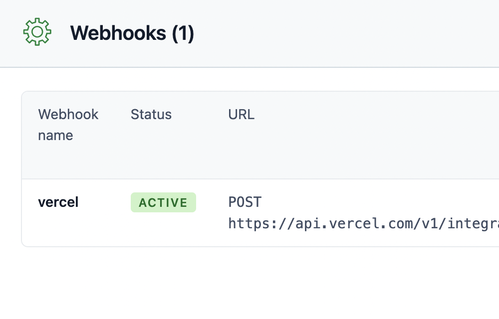

[前回記事]((../next-contentful1/)) ではContentfulでコンテンツモデルや記事の準備、トークンの発行をするところまで進めました。本記事では、Next.jsを用いてContentfulの記事を読み込む流れを記載します。

なお、バージョンや事前準備などは前回記事記載のとおりとなります。

## ローカル環境変数の登録

まずはローカル環境変数として、前回取得した各種IDやアクセストークンを追加していきましょう。今回は`dotenv`を利用します。

```
yarn add dotenv
```

- .env

```
CONTENTFUL_ENVIRONMENT=master
CONTENTFUL_SPACE_ID=(スペースID)
CONTENTFUL_DELIVERY_ACCESS_TOKEN=(コンテンツ取得用アクセストークン)
CONTENTFUL_MANAGEMENT_ACCESS_TOKEN=(管理用アクセストークン)
CONTENTFUL_PROFILE_ENTRY_ID=(プロフィールエントリのENTRY ID)
CONTENTFUL_RESUME_ENTRY_ID=(職務経歴エントリのENTRY ID)
CONTENTFUL_WORKS_ENTRY_ID=(つくったものエントリのENTRY ID)
```

`process.env`で各種パラメータが読み込めることを確認しておくとよいでしょう。

なお、最初の`CONTENTFUL_ENVIRONMENT`はデフォルトで`master`となっているので、特に変更していない場合は`master`を記載しておけばOKです。

## パッケージのインストール (1)

これからContentful用に用意されているいくつかのパッケージをインストールするのですが、解説の都合から目的ごとに分けて導入していきます。

```
yarn add contentful @contentful/rich-text-react-renderer
```

`contentful`はコンテンツ取得などの基本的な操作を行うAPIを提供してくれるパッケージで、`@contentful/rich-text-react-renderer`はコンテンツモデル内の「リッチテキスト」フィールドに記載した内容をJSXとしてレンダリングしてくれるパッケージです。こういった機能があらかじめ提供されているのは、とても便利ですね！

## クライアントの初期化

[公式](https://www.contentful.com/developers/docs/javascript/tutorials/using-js-cda-sdk/)のとおり初期化を行います。私は専用のファイルを作成し、exportして利用できるようにしました。

- service/contentful.ts

```typescript
import { createClient } from 'contentful';

const client = createClient({
  space: process.env.CONTENTFUL_SPACE_ID,
  accessToken: process.env.CONTENTFUL_DELIVERY_ACCESS_TOKEN,
});

export default client;
```

環境変数として登録したスペースIDとコンテンツ取得用アクセストークンを読み込みます。

## getStaticProps でエントリを取得して表示

Contentful上のコンテンツを読み込みたいページの`getStaticProps`上でデータ取得を行い、`@contentful/rich-text-react-renderer`でリッチテキストのレンダリングを行います。

下記は「プロフィール」ページのコードから、解説と無関係のコンポーネントに関する記述を省いたものです。

- pages/profile/index.tsx

```jsx
import { NextPage, InferGetStaticPropsType } from 'next';
import { documentToReactComponents } from '@contentful/rich-text-react-renderer';
import client from 'service/contentful';

export const getStaticProps = async () => {
  const response = await client.getEntry(
    // 「プロフィール」のエントリID
    process.env.CONTENTFUL_PROFILE_ENTRY_ID,
  );

  return {
    props: {
      // ここでの「text」はリッチテキストを指していますが、各フィールドの名前はコンテンツモデルの作成時に任意のものを設定できます
      text: response.fields.text,
    },
  };
};

type Props = InferGetStaticPropsType<typeof getStaticProps>;

const Profile: NextPage<Props> = ({ text }) => (
  <div>
    {text && documentToReactComponents(text, renderOptions)}
  </div>
);

export default Profile;
```

リッチテキストがJSXとして展開され、あらかじめ設定したスタイルのとおり表示されます！



前回記事では「つくったもの」のセクションのみ「複数のコンテンツモデルへの参照を登録する」という作りにしていましたが、データの読み込み方自体は特に変わりません。[実物のコード](https://github.com/naberyo34/szmd/blob/master/src/pages/works/index.tsx) も参考にしてみてください。

## パッケージのインストール (2)

あえてここまでスルーしていましたが、現状のままでは`response`として取得されたデータの型がすべて`any`型となってしまい、TypeScriptに怒られてしまいます。これらをひとつひとつ手動で型定義するのは骨の折れる作業です。

ありがたいことに「コンテンツモデルをチェックして、型定義を自動生成する」[contentful-typescript-codegen](https://github.com/intercom/contentful-typescript-codegen)というパッケージが有志によって公開されていますので、こちらを導入します。

```
yarn add contentful-management contentful-typescript-codegen
```

`contentful-management`はContentfulで管理系の機能を扱うための公式パッケージです。併せて必要になるので、追加しておきましょう。

## contentful-typescript-codegenを使う

利用準備として、[README](https://github.com/intercom/contentful-typescript-codegen#readme)に書いてあるとおりの手順を実施しましょう。`yarn contentful-typescript-codegen`が動作するところまで進めればOKです。

スクリプトを実行すると、プロジェクトのルートディレクトリに`@types/generated/contentful.d.ts`という型定義ファイルが生成されます。

- @types/generated/contentful.d.ts

```typescript
// THIS FILE IS AUTOMATICALLY GENERATED. DO NOT MODIFY IT.

import { Asset, Entry } from 'contentful';
import { Document } from '@contentful/rich-text-types';

export interface IProfileFields {
  /** 本文 */
  text?: Document | undefined;
}

/** /profile に表示する自己紹介文です。リッチテキストで入力できます。 */

export interface IProfile extends Entry<IProfileFields> {
  sys: {
    id: string;
    type: string;
    createdAt: string;
    updatedAt: string;
    locale: string;
    contentType: {
      sys: {
        id: 'profile';
        linkType: 'ContentType';
        type: 'Link';
      };
    };
  };
}

// (以下省略)
```

Contentful上に記載したコンテンツモデルの説明を読み込んで、TSDoc化までしてくれるのがとても素敵ですね。あとは型定義を読み込んで、`response`に設定してあげればOKです！

- pages/profile.tsx

```typescript
// (前略)

import { IProfileFields } from '../../../@types/generated/contentful';

export const getStaticProps = async () => {
  const response = await client.getEntry<IProfileFields>(
    process.env.CONTENTFUL_PROFILE_ENTRY_ID,
  );

  return {
    props: {
      text: response.fields.text,
    },
  };
};

// (以下省略)
```

以上でコーディング手順は終了です！ローカルで正しく動作することを確認しておきましょう。

## Vercelへの環境変数登録

ビルド時にも環境変数を利用するため、Vercelプロジェクトに環境変数を登録します。「Settings」→「Environment Variables」から登録できます。変数名はローカルと同様にしておきましょう。



## Webhookの設定

ここまで設定すればビルドは正しく行えるはずですが、`getStaticProps`(SSG)を利用する場合はビルド時にしかContentfulのデータを取得しないため、エントリを更新した際には自動的に再ビルドをするためにWebhook設定をしておきましょう。

### Vercel側の設定

まずはVercel側の「Settings」→「Git」→「Deploy Hooks」から、「Create Hook」でURLを生成します。Webhookを動作させたいブランチを指定します（私は`master`で設定しました）。



生成されたURLは控えておきましょう。

### Contentful側の設定

続いて、Contentful側で「Settings」→「Webhooks」から、「Add Webhook」で控えたURLを入力します。



これによって、Contentfulでコンテンツを追加、更新、削除したときなどにVercelに通知が飛び、自動的に再ビルドを行うことができるようになります！

※「エントリの追加時は再ビルドするが更新時はしない」など、Webhookのトリガーとなるイベントを詳細に設定することもできます。

以上で、Contentfulから簡単にコンテンツの管理、更新ができるポートフォリオの完成です！

## おわりに

やや性急な解説になってしまいましたが、ContentfulによるJAMStack構成をNext.jsで実現する際の全体感が伝われば幸いです。

今回はかなりシンプルな設計にしましたが、より複雑なコンテンツモデルを作成することもできるので、業務利用にも耐えうるポテンシャルを秘めたHeadless CMSだと思います。ぜひ利用してみてください。
