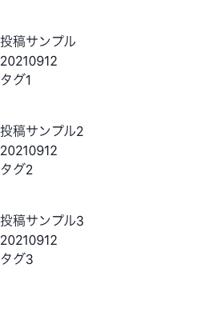

## はじめに

本ブログでも利用されている[Gatsby.js](https://www.gatsbyjs.com/)は、GraphQLを用いてコンテンツを読み込み静的ページを生成する「SSG」としての機能に特化したフレームワークだ。そのため、公式で用意されたボイラープレートを利用すればかなりお手軽にブログサイトを作成することができる。

一方で、[Next.js](https://nextjs.org/)はSSRやSSGをはじめとする数多くの機能を備えたより汎用的なフレームワークであり、ブログサイトを作成する際には、コンテンツを読み込むロジックなどを自前で実装していく必要がある（そのぶんNext.jsは複雑なWebアプリ制作にも耐えうる柔軟性があり、両者は得意とすることが異なる）。

今回はあえてNext.jsを使って簡素なMarkdownブログを作成することで、Next.jsの核である`getStaticPaths`や`getStaticProps`などの機能について理解を深めていく。

## 事前準備

開発に用いたパッケージのバージョンや事前の環境構築については[前回の記事](../next-getting-started)に記載した。

なお、以下に記載する手順は、[公式記事](https://nextjs.org/blog/markdown)を参考にしている。

## Markdownファイルを用意する

今回はGatsbyの仕様に似せて、

- `content`フォルダ配下にmarkdownを配置する
- `.md`ファイルを格納するフォルダ名が記事のslugとなる

という仕様で進めていく。以下のようにサンプルファイルをいくつか作成した。


中身には、ひとまず「YAML形式で記述した記事情報を取得できること」を確認するために下記のように最小限の情報を入れておくとよい。

```
---
title: "投稿サンプル"
date: "20210912"
tags: ["タグ1"]
---

## これはサンプル記事1です

本文
```

## Markdownをコンパイルするための準備

まずは`.md`ファイルを解釈してHTMLに変換するためのパッケージが必要となる。選択肢が色々あるようだが、今回は[公式のコード例](https://github.com/vercel/next.js/blob/canary/examples/blog-starter/)をリファレンスとした。

```
yarn add remark remark-html gray-matter
```

ざっくりと

- `remark`: markdownを解釈するパッケージ
- `gray-matter`: markdown上に埋め込んだYAML(タイトルやタグ情報などを入れたいときに使う)を解釈するパッケージ

というものだ。この`remark`は追加できるプラグインなどが多いため少々ややこしいのだが、[こちら](https://qiita.com/sankentou/items/f8eadb5722f3b39bbbf8)のQiita記事が参考になった。

## .mdファイルを読み込む

`remark`による構文変換を行う前段階として、まず`.md`ファイルを`fs`で読み込む必要がある。そのための関数を作成していこう(この関数は、後述する`getStaticProps`の中で実行する)。

- utils/api.ts

```ts
import fs from 'fs';
import { join } from 'path';
import matter from 'gray-matter';

// postsが格納されているディレクトリを取得する
// memo: process.cwd() はカレントディレクトリ
const postsDirectory = join(process.cwd(), 'content');

// posts配下にあるディレクトリ名(slug)をすべて取得する
export const getPostSlugs = () => {
  // まずはファイル名、ディレクトリ名を両方取得する
  const allDirents = fs.readdirSync(postsDirectory, { withFileTypes: true });
  // ディレクトリ名のみに絞り込んで返す
  return allDirents
    .filter((dirent) => dirent.isDirectory())
    .map(({ name }) => name);
};

/**
 * 与えられたslugから記事の内容を取得して返す
 * @param slug
 * @param fields 取得したい値 (slug | content | title | tags)
 */
export const getPostBySlug = (slug: string, fields: string[] = []) => {
  // ファイルを読み込む
  const fullPath = join(postsDirectory, slug, 'index.md');
  const fileContents = fs.readFileSync(fullPath, 'utf8');
  const { data, content } = matter(fileContents);
  type Item = {
    slug: string;
    content: string;
    title: string;
    date: string;
    tags: string[];
  };

  const items: Item = {
    slug: '',
    content: '',
    title: '',
    date: '',
    tags: [],
  };

  // 指定された値を取得してくる
  // memo: slugが指定されたとき、contentが指定されたとき、frontmatterの中身が指定されたときで返却の仕方が異なる
  fields.forEach((field) => {
    if (field === 'slug') {
      items[field] = slug;
    }
    if (field === 'content') {
      items[field] = content;
    }

    if (field === 'title' || field === 'date' || field === 'tags') {
      items[field] = data[field];
    }
  });

  return items;
};

/**
 * すべての記事から指定したfieldsの値を取得する
 * @param fields 取得したい値 (slug | content | title | tags)
 */
export const getAllPosts = (fields: string[] = []) => {
  const slugs = getPostSlugs();
  const posts = slugs
    .map((slug) => getPostBySlug(slug, fields))
    .sort((a, b) => {
      // 辞書順ソート
      // 目的に応じて、日付順などでソートしてもよい
      const slugA = a.slug.toString().toLowerCase();
      const slugB = b.slug.toString().toLowerCase();

      if (slugA > slugB) {
        return 1;
      } else {
        slugB > slugA;
      }

      return slugA >= slugB ? 1 : -1;
    });

  return posts;
};

```

やや複雑に見えるかもしれないが、整理すると

- `content`配下のディレクトリ名をslugとして読み込む
- `gray-matter`を利用して、`.md`のYAML部分と本文を分割する
- 「ある記事の特定の情報」および「全記事の特定の情報」を取得できる関数を作成する

という処理を書いている。

※この時点ではmarkdownの本文部分はプレーンテキストとして取得しているだけで、`remark`による変換は行われていない。

## TOPページに記事一覧を表示する

まずは、`content`内にある記事をすべて取得しTOPページに一覧表示を行ってみよう。

- src/pages/index.tsx

```tsx
import { NextPage, InferGetStaticPropsType } from 'next';
import { Box } from '@chakra-ui/react';
import { getAllPosts } from '@/utils/api';

type Props = InferGetStaticPropsType<typeof getStaticProps>;

export const getStaticProps = async () => {
  const allPosts = getAllPosts(['slug', 'title', 'date', 'tags']);

  return {
    props: { allPosts },
  };
};

const Home: NextPage<Props> = ({ allPosts }) => (
  <ul>
    {allPosts?.map((post) => (
      <Box key={post.slug} mt={10}>
        <li>
          <h2>{post.title}</h2>
          <p>{post.date}</p>
          <ul>
            {post.tags?.map((tag) => (
              <li key={tag}>{tag}</li>
            ))}
          </ul>
        </li>
      </Box>
    ))}
  </ul>
);

export default Home;
```

ごく最小限のコードを記載している。見どころは`getStaticProps`で、先ほど作成した`getAllPosts`関数を利用してmarkdownファイルからの情報取得を行い、Propsとして`Home`コンポーネントに渡されているのがわかる。

なお、`InferGetStaticPropsType`というNext.js組み込みの型を使うことで、`getStaticProps`の返り値からPropsの型を判断することができるのでとても便利だ。

表示結果は以下のようになる。



## slugをもとに記事ページを生成する

もちろん、これだけだと各記事の実体ページは作成されない。動的ルーティング機能を用いて、それぞれのページを生成してみる。

今回は`docs`ディレクトリの配下に記事ページを配置したかったため、`[slug].tsx`を下記のように配置している。

- src/pages/docs/[slug].tsx

```tsx
import { NextPage, InferGetStaticPropsType } from 'next';
import { getAllPosts, getPostBySlug } from '@/utils/api';

type Props = InferGetStaticPropsType<typeof getStaticProps>;

export const getStaticPaths = async () => {
  const posts = getAllPosts(['slug']);

  return {
    paths: posts.map((post) => {
      return {
        params: {
          slug: post.slug,
        },
      };
    }),
    fallback: false,
  };
};

export const getStaticProps = async ({ params }: any) => {
  const post = getPostBySlug(params.slug, [
    'slug',
    'title',
    'date',
    'tags',
    'content',
  ]);

  return {
    props: { post },
  };
};

const Post: NextPage<Props> = ({ post }) => (
  <article>
    <h2>{post.title}</h2>
    <p>{post.date}</p>
    <ul>
      {post.tags?.map((tag) => (
        <li key={tag}>{tag}</li>
      ))}
    </ul>
    <section>
      <p>{post.content}</p>
    </section>
  </article>
);

export default Post;
```

ここでは`getStaticPaths`が利用されている。全記事のslugを`getAllPosts`で取得し、そこで得たslugを`getStaticProps`にparamsとして渡すことでページを生成している。

`localhost:3000/docs/[slug]`にアクセスすると、下記のように記事が表示されるはずだ(存在しないslugを指定した場合は404となる)。


しかし、この時点では**コンテンツ部分のmarkdown記述を変換する**という作業が行われていないため、markdownのタグがそのまま表示されてしまっている。

## remark でmarkdownを整形して表示する

まずは`remark`を用いた構文変換の関数を作る。

- src/utils/markdownToHtml.ts

```ts
import { remark } from 'remark';
import html from 'remark-html';
/**
 * remarkによるmarkdownの構文変換を行う
 * @param markdown markdown記法で書かれたプレーンテキスト
 * @returns 変換結果をString化したもの
 */
const markdownToHtml = async (markdown: string) => {
  const result = await remark().use(html).process(markdown);
  return result.toString();
};

export default markdownToHtml;
```

続いて、さきほどの`[slug].tsx`の`getStaticProps`内でこの関数を利用する。

- src/Pages/docs/[slug].tsx

```tsx
// ...

export const getStaticProps = async ({ params }: any) => {
  const post = getPostBySlug(params.slug, [
    'slug',
    'title',
    'date',
    'tags',
    'content',
  ]);
  // ここで変換
  const content = await markdownToHtml(post.content);

  // 変換結果をpropsとして渡す
  return {
    props: {
      post: {
        ...post,
        content,
      },
    },
  };
};

const Post: NextPage<Props> = ({ post }) => (
  <article>
    <h2>{post.title}</h2>
    <p>{post.date}</p>
    <ul>
      {post.tags?.map((tag) => (
        <li key={tag}>{tag}</li>
      ))}
    </ul>
    <section>
      {/* ここでdangerouslySetInnerHTMLを使ってHTMLタグを出力する */}
      <div dangerouslySetInnerHTML={{ __html: post.content }} />
    </section>
  </article>
);

export default Post;
```

スタイルを付与していないため少々わかりづらいが、`##`がきちんと`h2`として解釈されている。


## TOPページから記事ページへのリンクを行う

最後に、作成した記事ページにTOPページからアクセスできるようにする。`next/link`を使えばよい。

- src/Pages/index.tsx

```tsx
// ...

const Home: NextPage<Props> = ({ allPosts }) => (
  <ul>
    {allPosts?.map((post) => (
      <Box key={post.slug} mt={10}>
        <li>
          <Link href={`/docs/${post.slug}`}>
            <a>{post.title}</a>
          </Link>
          <p>{post.date}</p>
          <ul>
            {post.tags?.map((tag) => (
              <li key={tag}>{tag}</li>
            ))}
          </ul>
        </li>
      </Box>
    ))}
  </ul>
);
```

## おわりに

今回は公式サンプルをアレンジしながら再実装するような流れで進めてみたが、どのような仕組みで作られているか、カスタマイズする際にどこを触ればよいかをかなり理解できたと感じている。

Next.jsはDXがかなり洗練されている印象を受け、使っていてとても楽しいので引き続き学習を進めていきたい。
