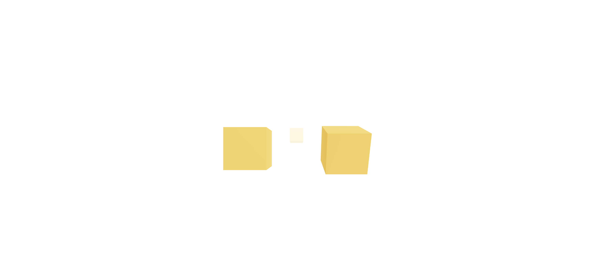

※この記事は[Qiita](https://qiita.com/naberyo34/items/181f817ddd38c74dbc76)に投稿した記事の再掲です。

## はじめに

JavaScriptで3D表現を行う著名なライブラリとして[Three.js](https://threejs.org/)というものがあります。

こちらは文句なしに高機能な定番ライブラリなのですが、命令的なコードの書き方を求められるため、Reactの宣言的なコードと組み合わせて使うのが少々面倒だったりします。

ある程度Three.jsに慣れていないと、コードの可読性もあまり高くないですね。

- Three.jsのコード例（[ics.mediaの解説記事](https://ics.media/entry/14771/)より引用）

```javascript
window.addEventListener("DOMContentLoaded", init);

function init() {
  const width = 960;
  const height = 540;

  const renderer = new THREE.WebGLRenderer({
    canvas: document.querySelector("#myCanvas")
  });
  renderer.setPixelRatio(window.devicePixelRatio);
  renderer.setSize(width, height);

  const scene = new THREE.Scene();

  const camera = new THREE.PerspectiveCamera(
    45,
    width / height,
    1,
    10000
  );
  camera.position.set(0, 0, +1000);

  const geometry = new THREE.BoxGeometry(500, 500, 500);
  const material = new THREE.MeshStandardMaterial({
    color: 0x0000ff
  });
  const box = new THREE.Mesh(geometry, material);
  scene.add(box);

  const directionalLight = new THREE.DirectionalLight(
    0xffffff
  );
  directionalLight.position.set(1, 1, 1);

  scene.add(directionalLight);

  renderer.render(scene, camera);
}
```

しかし、実は現代のフロントエンド事情に合わせて「Three.jsとReactを併用したい」というニーズに特化したライブラリ、[react-three-fiber](https://github.com/pmndrs/react-three-fiber)というものが存在します。

これを使うと、なんとThree.jsのコードを

- [LIGの解説記事](https://liginc.co.jp/587025)より引用

```jsx
import { Canvas } from '@react-three/fiber';

export default function App() {
  return (
    <Canvas>
      <ambientLight />
      <directionalLight />
      <mesh>
        <boxBufferGeometry />
        <meshLambertMaterial />
      </mesh>
    </Canvas>
  );
}
```

このようにJSXライクに書くことができます！見るからにわかりやすいですよね。私は初めて見たとき感動しました。

今回はreact-three-fiberを使って、オブジェクトを配置したりカメラを動かしたりする基本的な操作を解説していきます！

## 前提、対象読者

私は特に3D技術やThree.jsにすごく精通しているというわけではなく、ごく基礎的な機能がわかる程度です。そのため、本記事は「Reactはわかるけど、3Dはほとんど扱ったことがない」方向けの解説となります。

## 環境

- Typescript 4.6.4
- Next.js 12.1.5

`npx create-next-app@latest --ts`しただけの状態です。

※初期セットアップが楽なのでNext.jsを利用していますが、今回はNext.jsの独自機能は特に利用しないので、通常のReact環境でも問題ありません。その際は、Next.js向けの記述は適宜読み替えてください。

- Three.js 0.140.0
- react-three-fiber 8.0.12
- drei (後述) 9.6.0

## パッケージインストール

```
yarn add three @react-three/fiber @react-three/drei
```

```
yarn add -D @types/three
```

まずはパッケージを導入していきます。Three.js本体（`three`）と、react-three-fiberをより便利に活用するためのツール集「drei」（`@react-three/drei`）をあわせてインストールしておきましょう。

TypeScriptを利用する場合は、Three.jsの型定義も追加します。

## サンプルコードを動かしてみる

react-three-fiberは[公式ドキュメント](https://docs.pmnd.rs/react-three-fiber/getting-started/introduction)がそこまで大充実しているわけではない（といっても、最低限のことは書いてあるので目を通しておくと◎です！）ので、手っ取り早くコードの書き方を知るにはサンプルコードや[作例](https://docs.pmnd.rs/react-three-fiber/getting-started/examples)を参考にするのがオススメです。

まずは上記ドキュメント「Getting Started」に書いてあるコードを拝借して、動作させてみましょう。

以下は、未使用変数の削除や型定義を行って簡単に記述を整理した例です。

- src/pages/index.tsx

```jsx
import { NextPage } from 'next';
import { useRef, useState } from 'react';
import { Canvas, useFrame } from '@react-three/fiber';
import { Mesh } from 'three';

type BoxProps = {
  position: [x: number, y: number, z: number];
};

const Box: React.FC<BoxProps> = (props) => {
  const mesh = useRef<Mesh>(null!);
  const [hovered, setHover] = useState(false);
  const [active, setActive] = useState(false);
  useFrame(() => (mesh.current.rotation.x += 0.01));

  return (
    <mesh
      {...props}
      ref={mesh}
      scale={active ? 1.5 : 1}
      onClick={() => setActive(!active)}
      onPointerOver={() => setHover(true)}
      onPointerOut={() => setHover(false)}
    >
      <boxGeometry args={[1, 1, 1]} />
      <meshStandardMaterial color={hovered ? 'hotpink' : 'orange'} />
    </mesh>
  );
};

const Home: NextPage = () => (
  {/* 画面いっぱいにCanvasが表示されるようdivでラップしている */}
  <div style={{ width: '100vw', height: '100vh' }}>
    <Canvas>
      <ambientLight />
      <pointLight position={[10, 10, 10]} />
      <Box position={[-1.2, 0, 0]} />
      <Box position={[1.2, 0, 0]} />
    </Canvas>
  </div>
);

export default Home;
```


画面いっぱいに、2つのくるくると回る立方体が表示されていれば正しく動作しています。立方体にマウスカーソルをhoverすると色が変わり、クリックすると大きくなる簡単なインタラクションもついています。

## サンプルコードを読み解く

### Box

```jsx
const Box: React.FC<BoxProps> = (props) => {
  const mesh = useRef<Mesh>(null!);
  const [hovered, setHover] = useState(false);
  const [active, setActive] = useState(false);
  useFrame(() => (mesh.current.rotation.x += 0.01));

  return (
    <mesh
      {...props}
      ref={mesh}
      scale={active ? 1.5 : 1}
      onClick={() => setActive(!active)}
      onPointerOver={() => setHover(true)}
      onPointerOut={() => setHover(false)}
    >
      <boxGeometry args={[1, 1, 1]} />
      <meshStandardMaterial color={hovered ? 'hotpink' : 'orange'} />
    </mesh>
  );
};
```

回転する立方体は「Box」コンポーネントとして記述されています。`useState`でホバー、クリック時のstateを管理しており、`onClick`や`onPointerOver`、`onPointerOut`で見た目が変わるように設定されています。

`useFrame`というreact-three-fiberで用意されているCustom hookでは`requestAnimationFrame`相当の記述ができ、ここでは「1フレームごとにメッシュのx軸角度を+0.01する」という処理が行われています。かなり直感的にアニメーションを作成することができますね。

### Canvas

```jsx
const Home: NextPage = () => (
  {/* 画面いっぱいにCanvasが表示されるようdivでラップしている */}
  <div style={{ width: '100vw', height: '100vh' }}>
    <Canvas>
      <ambientLight />
      <pointLight position={[10, 10, 10]} />
      <Box position={[-1.2, 0, 0]} />
      <Box position={[1.2, 0, 0]} />
    </Canvas>
  </div>
);
```

react-three-fiberが提供する`Canvas`は、その名のとおりThree.jsでの描画を行うcanvas領域を作成してくれます。親要素いっぱいに描画領域が広がるようになっているので、サイズの調整も簡単にできます。

`Canvas`の中では`ambientLight`（環境光）などのScene設定を追加したり、先ほどの`Box`コンポーネントを読み込むことができます。

以上のように、モデルやシーンをJSXライクな書き方でコンポーネントとして分割しながら書くことができるので、ある程度Reactに慣れている方はサクサク進めることができると思います！最高ですね。

## サンプルコードをカスタマイズしてみよう

上記のコードを使って、もう少し遊んでみることにします。

### Boxを追加する

まずは肩慣らしとして`Box`を追加してみましょう。`position`をpropsとして渡せるように作られているので、既存の2つの箱より少し画面奥に配置してみます。

```jsx
const Home: NextPage = () => (
  <div style={{ width: '100vw', height: '100vh' }}>
    <Canvas>
      <ambientLight />
      <pointLight position={[10, 10, 10]} />
      <Box position={[0, 1, -10]} />{/* <= 追加 */}
      <Box position={[-1.2, 0, 0]} />
      <Box position={[1.2, 0, 0]} />
    </Canvas>
  </div>
);
```


画面中心に小さく映っているのが、新たに追加した`Box`です。

### Fog（霧）の効果を加えてみる

次は[Fog](https://ics.media/tutorial-three/fog/)を追加してみましょう。通常のThree.jsでは

```js
const scene = new THREE.Scene();
scene.fog = new THREE.Fog('#fff', 1, 20);
```

のように書くところを、react-three-fiberでは

```jsx
const Home: NextPage = () => (
  <div style={{ width: '100vw', height: '100vh' }}>
    <Canvas>
      <ambientLight />
      <fog attach="fog" color={'#fff'} near={1} far={20} />{/* <= 追加 */}
      <pointLight position={[10, 10, 10]} />
      <Box position={[0, 1, -10]} />
      <Box position={[-1.2, 0, 0]} />
      <Box position={[1.2, 0, 0]} />
    </Canvas>
  </div>
);
```

と書きます。カメラから遠くに行くほど色が白くなるFogを設定したので、



先ほど追加した画面奥のBoxの色合いが薄くなっていますね！

### マウスカーソルに連動してカメラを動かす

続いては公式の[カッコいいサンプル](https://codesandbox.io/s/figma-noodles-iedfg)を参考に、マウスカーソルの動きに合わせてカメラが動くような実装を行ってみます。

```jsx
// 「Vector3」のインポートを追加
import { Mesh, Vector3 } from 'three';

// 略

const Rig = ({ v = new Vector3() }) => {
  return useFrame((state) => {
    state.camera.position.lerp(v.set(state.mouse.x / 2, state.mouse.y / 2, 10), 0.05)
  })
};

const Home: NextPage = () => (
  <div style={{ width: '100vw', height: '100vh' }}>
    <Canvas>
      <ambientLight />
      <Rig />{/* <= 追加 */}
      <fog attach="fog" color={'#fff'} near={1} far={20} />
      <pointLight position={[10, 10, 10]} />
      <Box position={[0, 1, -10]} />
      <Box position={[-1.2, 0, 0]} />
      <Box position={[1.2, 0, 0]} />
    </Canvas>
  </div>
);
```


マウスカーソルに合わせてカメラが気持ちよくグリグリ動いてくれます。こういったインタラクティブな動きがあると、3Dらしさがグッと向上しますね。

ちなみに[lerp](https://threejs.org/docs/#api/en/math/Vector3.lerp)とは「線形補間」のことで、今回はヌルヌルとした座標変化を表現するために使われています。第2引数として渡しているアルファ値(上記では`0.05`)を変えてあげると、より慣性のかかったような動きの表現もできます。ぜひ色々遊んでみてください。

### テキストを配置する

またしても上記のサンプルを参考に、今度はテキストを3D空間に配置してみましょう。
簡単にテキストを表示できる機能が`drei`に用意されているので、こちらを利用します。

※publicディレクトリにフォントファイルを配置して読み込む必要があるので、用意しておきましょう。

```jsx
import { Text } from '@react-three/drei';

// 略

const Home: NextPage = () => (
  <div style={{ width: '100vw', height: '100vh' }}>
     <Canvas>
      <ambientLight />
      <Rig />
      <fog attach="fog" color={'#fff'} near={1} far={20} />
      <pointLight position={[10, 10, 10]} />
      <Box position={[0, 1, -10]} />
      <Box position={[-1.2, 0, 0]} />
      <Box position={[1.2, 0, 0]} />
      {/* 追加 */}
      <Text
        position={[0, 1, 0]}
        font="/Roboto-Black.ttf"
        fontSize={2}
        color={'#222'}
      >
        HELLO
      </Text>
      <Text
        position={[0, 0, 2]}
        font="/Roboto-Black.ttf"
        fontSize={2}
        color={'#222'}
      >
        WORLD
      </Text>
      {/* 追加ここまで */}
    </Canvas>
  </div>
);
```


奥行きを変えてテキストを配置してみました。これだけでもちょっとカッコいいですね！

## Blenderで自作したモデルを読み込む

ここからは少しだけ高度な内容になります。3Dモデリングツールの利用経験がない方は、スキップしてしまっても大丈夫です！

単純な図形などのメッシュはThree.jsで作成できますが、自作したモデルを配置できたらもっと楽しいですよね。

ライブラリの開発者によって、`glb`や`gltf`形式で保存したモデルをreact-three-fiberの書き方に変換してくれるスクリプトが提供されていますので利用してみましょう。

### モデルデータを用意する

まずはBlenderで適当なモデルを制作します。今回は手っ取り早く、おなじみ[スザンヌくん](https://en.wikipedia.org/wiki/Blender_(software)#Suzanne)で試してみます。


スザンヌくんのモデルを作成したら、「ファイル」→「エクスポート」→「glTF 2.0」を選択します。

今回は特にテクスチャを含んでいませんが、もしテクスチャの情報もあわせて埋め込む必要がある場合、フォーマットは「glTF Embedded」を選択しておきましょう。

ファイルが作成できたら、プロジェクトの`public`ディレクトリに配置して参照できるようにしておきます。

### react-three-fiber用のコードを生成する

続いて、`glb`もしくは`gltf`ファイルを[こちら](https://gltf.pmnd.rs/)のページにドラッグアンドドロップしてコードを生成します。

※ツールのドキュメントは[ここ](https://github.com/pmndrs/gltfjsx)にあります。


プレビューをチェックして問題なければ、コードをコピーして自分のプロジェクトに取り込みましょう。私は`src/components/Monkey.tsx`として保存しました（自動生成のコードなので、適宜`@ts-nocheck`を使用してもよいと思います）。

- src/components/Monkey.tsx

```jsx
// @ts-nocheck
/*
Auto-generated by: https://github.com/pmndrs/gltfjsx
*/

import React, { useRef } from "react";
import { useGLTF } from "@react-three/drei";

export default function Model(props) {
  const group = useRef();
  const { nodes, materials } = useGLTF("/untitled.glb");
  return (
    <group ref={group} {...props} dispose={null}>
      <mesh
        castShadow
        receiveShadow
        geometry={nodes.モンキー.geometry}
        material={nodes.モンキー.material}
      />
    </group>
  );
}

useGLTF.preload("/untitled.glb");
```

あとは`index.tsx`に戻って、`Canvas`内でモデルを読み込んであげましょう！

```jsx
import Monkey from 'components/Monkey';

// 略

const Home: NextPage = () => (
  <div style={{ width: '100vw', height: '100vh' }}>
     <Canvas>
      <ambientLight />
      <Rig />
      <fog attach="fog" color={'#fff'} near={1} far={20} />
      <pointLight position={[10, 10, 10]} />
      <Box position={[0, 1, -10]} />
      <Box position={[-1.2, 0, 0]} />
      <Box position={[1.2, 0, 0]} />
      <Text
        position={[0, 1, 0]}
        font="/Roboto-Black.ttf"
        fontSize={2}
        color={'#222'}
      >
        HELLO
      </Text>
      <Text
        position={[0, 0, 2]}
        font="/Roboto-Black.ttf"
        fontSize={2}
        color={'#222'}
      >
        WORLD
      </Text>
      <Monkey position={[0, 0, 2]} />{/* <= 追加。propsとしてpositionを渡せます */}
    </Canvas>
  </div>
);
```


なんだか混沌とした絵面になってしまいましたが、無事に表示されました！

最初の立方体と同じように、`useFrame`と併用してあげることでモデルをくるくる回転させたり色々遊べます。

## 注意点

最後に、ちょっと気になった点も紹介しておきます（※Three.js初学者の感想）。

### react-three-fiber特有の書き方の情報が少ない

プレーンなThree.jsでどのように実装するかのイメージがついていても、react-three-fiber特有の文法に直した書き方がいまいちわからないことが多々あります。多くの場合、コンポーネントに渡せるプロパティ名は本家Three.jsを踏襲しているので、[公式ドキュメント](https://threejs.org/docs/)とにらめっこすれば解決できることも多いです。

ただし、たとえば今回でいうと`Fog`を利用する際に

```jsx
<fog attach="fog" color={'#fff'} near={1} far={20} />
```

`attach`というpropsを渡さないと動作しないことがわからず

```jsx
<fog color={'#fff'} near={1} far={20} />
```

と書いても動かない……なぜ……といった場面にも遭遇しました。公式ドキュメントがそれほど完璧にまとまっているわけではないので、適宜じっくり調べながら進める必要があると思います。

### Three.js関連の型定義が難しい

これはreact-three-fiberというよりはThree.js自体の問題なのですが、Three.js + TypeScriptでの開発に慣れている方でないと「どんな型が用意されているのか？」「取得した要素にどんな型を当てればいいのか？」を判断するのが少し難しいです。なるべく`any`を使わないように頑張りましたが、あちこち調べ回る必要がありました。笑

## おわりに

とはいえ、Reactのコードを書く感覚で3Dを自在に操れるのはとにかく楽しく、やみつきになります。この記事で、少しでもreact-three-fiberの魅力が伝われば幸いです！
