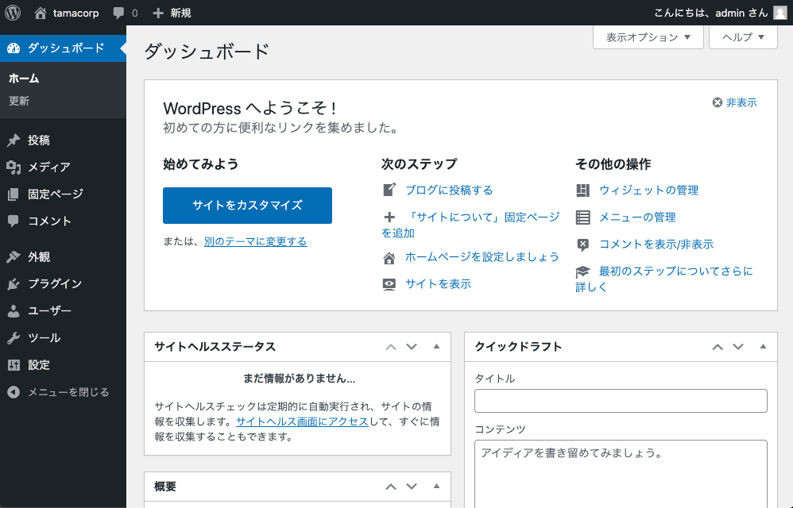
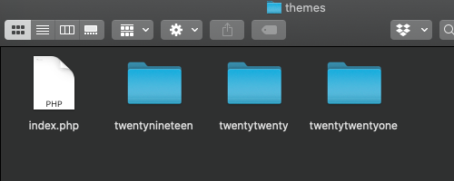
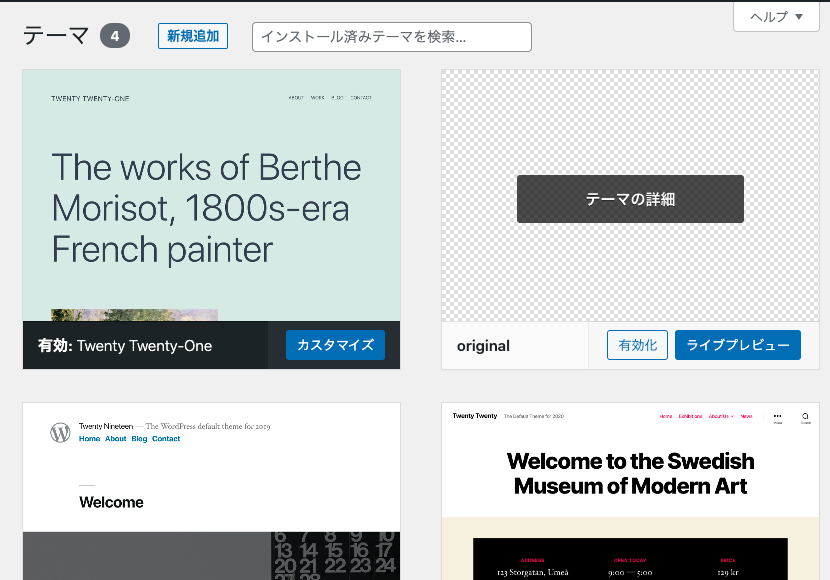
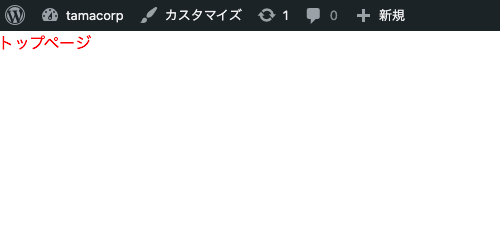
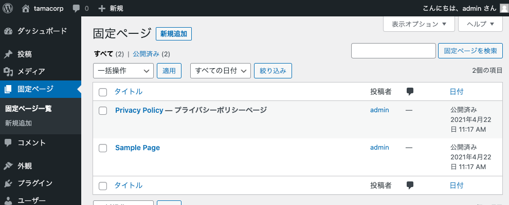
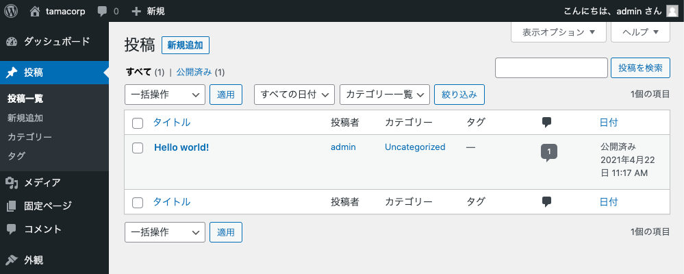
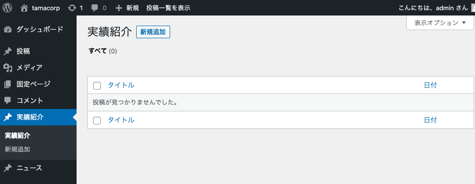

## はじめに

WordPressは全世界に存在するウェブサイトの40%(!)で利用されており、なおも増加し続けているという。もちろん**2021年の話**だ。ソースは[こちら](https://w3techs.com/technologies/history_overview/content_management/all)。

近年ではよりミニマルでFEフレンドリーなAPIベースのHeadless CMSなどが登場してはいるものの、ホビーユースならともかくプロダクトで利用する場合はやはり圧倒的シェアを誇るWordPressの「安定」感は捨てがたいし、豊富な情報やプラグインの存在から「だいたいの要件がWPで実現できる」という信頼と実績がある。

例えばコーポレートサイトにおける「投稿可能な『実績紹介ページ』」や「お問い合わせフォーム」はWPがあれば難なく作れるだろう。

さらに、エンジニアでなくてもGUIでコンテンツ運用ができる点もメリットだ。運用までエンジニアがやるのであれば、このブログのように「`.md`ファイルをリポジトリに生やせば更新されるぞ」でも別にかまやしないのだが。

結論として、依然WordPressが「**Webを仕事にする以上はちょっとくらい触れたほうがなにかと便利**」なツールなのは事実だと思う。少なくとも現時点では、すでにレガシーな滅びゆくツールなどでは決してない。

私はキャリア2年半程度のHTMLコーダー上がりへっぽこFEだが、WordPressには少なからず苦手意識がある。というのも、

- プラグインなどがあり多機能な一方、やりたいことを実現する手段がややこしいイメージ。WPの敷いた巨大なレールに乗ることを強いられそう
- 独特な用語やお作法が多く、覚えるのが面倒そう

という（偏見も含む）イメージがつきまとっていたからだ（※私の業務でのWP利用歴はたかが知れているので、あくまで素人イメージ）。

ところが最近、WPを業務である程度ちゃんと触る必要性に迫られた。そこでこの機会にざっくりとWPについて把握しておき、「なんとなくニガテ」という身も蓋もない状態から「とりあえずこうやって使えばいいのね」くらいのレベル感に持っていこうとしたのが今回の記事だ。

## 巷にあふれるWordPressの情報と今回の方針

WordPressについて少し調べるとすぐに気がつくのは、

- 既存のテーマをカスタムしたブログの運用方法など、ノンエンジニア向けの情報が多い。**自分にフィットする情報を探すのに骨が折れる**

ということ。

前提として、FEである私は

- HTMLやCSSを書くことには抵抗がなく、**サイトの骨格は既存テーマ等を使わずスクラッチで実装したい**。
- 過剰にプラグインを導入するくらいなら、PHPのコードを多少書いてカスタムしたほうが手っ取り早いと感じる。
- あえてWPを導入する理由としては「**コンテンツ管理**」を行いたい（+エンドユーザーに編集用のGUIを提供したい）から、という目的が主。あとはフォーム作成とか。

このような使い方をWPに求めている。そのため、本記事ではとにかく手早く「複数の投稿可能なコンテンツ」をサイトに組み込む方法を中心に解説したい。話がややこしくなるので、プラグインなどもあまり使わない方針で進めていく（実際は、必要に応じて導入すればよいだろう）。

### 注意点

- WordPressを用いたECサイトの作り方などの話は今回はしない。
- 初学者の備忘録的な記事のため、**WPにおけるアンチパターンを堂々と掲載している**可能性もある。気付いたタイミングで修正していきたい。

## 成果物の紹介

今回は「コーポレートサイト」を想定して、

- HTML/CSSで実装した複数の静的ページ
- 記事を投稿して追加が可能な「実績紹介」「ニュース」とその一覧ページ
- ごくシンプルな「お問い合わせフォーム」（プラグイン利用）

を組み込んだWebサイトを作成した（サンプルなので申し訳程度だが、スタイリングはすべて自前で行っている）。

個人のポートフォリオサイトなどにも転用できる内容だし、WordPress初学者が作るにはちょうどいい課題だと思う。

## ローカル環境の構築

WordPressはPHPの動くサーバー上で稼働する。今回は手っ取り早く[Local](https://localwp.com/)でローカル環境を立てて、そこで作業することにした。

特に設定にこだわりがない場合迷いようがないほど簡単に終わるため、説明は割愛。5秒でいつものダッシュボードが表示される。



ちなみに、WordPressのphpファイル等はローカルに保存されており、localの画面にリンクがあるためわかりやすい。phpを触るときはここから編集しよう。


## デフォルトのテーマを剥がす

WordPressには「テーマ」という概念があり、無料、有料で数多く公開されているテーマを選択するだけでコンテンツを管理するための設定の雛形やスタイルを提供してくれる。ところが、「コーポレートサイトを作る」などオリジナルのデザインありきのコーディングを行う際はこれが不要、**むしろ邪魔**となる。

今回は「WordPressを動かす上で最小の構成要素しかないテーマ」を新たに作成し、まっさらな状態から開発できるようにしてみよう。ここで作成した「無の自作テーマ」に追記していくことで実装を進めるイメージだ。

localのフォルダから`app/public/wp-content/themes/`にアクセスすると、初期のテーマ3種のフォルダが用意されている。



今回はここに追加で「original」というフォルダを作成し、新規のテーマとした。フォルダ内には

- index.php（トップページとして呼び出されるPHPファイル）
- style.css（基本のCSSファイル）
- functions.php（WordPressにまつわる設定を行うPHPファイル）

が最低限必要なので作成する。

### index.php

```php
<!DOCTYPE html>
<html lang="ja">
<head>
<meta charset="utf-8">
<title>架空会社たま</title>
<meta name="viewport" content="width=device-width, initial-scale=1" />
<?php wp_head(); ?>
</head>
<body>
<main>
<h1>トップページ</h1>
</main>
<?php wp_footer(); ?>
</body>
</html>
```

いったん、ここでは最小限のHTML構造を記載しておいた。

実際には、ページ共通の部分をheader.phpとfooter.phpに分割してindex.phpにはトップページ固有の記述のみを書く方法が推奨される。このあたりはデフォルトで搭載されているテーマを参考にするとわかりやすいので、実装を進める中でリファクタリングしていこう。

`wp_head()`と`wp_footer()`はWPが自動的に諸々のタグを挿入するための組み込み関数で、ないと後々困るらしい。おまじないとして入れておけばOKだ。

※devtoolsを見れば、挿入されているタグの詳細が確認できる。かなりがっつり挿入してくるので、不要なものはfunctions.phpの設定で調整することもできるようだ。

### style.css

```css
/*
Theme Name: 架空会社たま
*/

/* ここにリセットCSSを記述 */

/* 以下、任意の記述 */
h1 {
  color: red;
}
```

注意点として、コメントで`Theme Name`を記載することが必須である。それ以下には任意の記述を記載してよい。

とりあえず、今回はベタ打ちでリセットCSS（[minireset.css](https://jgthms.com/minireset.css/)）の記述をコピーし、反映されていることがわかりやすいようにh1を赤字にしてみた。

本格的な開発を行う場合は、SCSSなどをコンパイルする環境を用意して「style.css」としてビルドされるようにしてもよいだろう。

### functions.php

本当にただ空のテーマを読み込むだけであればこのファイルはなくてもよいのだが、どうせ絶対に後で作ることになるので今作っておく。

WordPressではCSSやJSを読み込む際に、headタグ内で読み込むのではなくfunctions.phpから組み込み関数を利用して読み込むのが推奨されている。

```php
// スタイルシートの読み込み
<?php
function add_files()
{
    wp_enqueue_style('default', get_stylesheet_uri());
}
add_action('wp_enqueue_scripts', 'add_files');

```

怒涛の勢いで出てくる見慣れない文字列はWordPressの組み込み関数である。WordPressのこういうところはちょっと「ウッ」となる部分でもあるのだが、[リファレンス](https://wpdocs.osdn.jp/%E9%96%A2%E6%95%B0%E3%83%AA%E3%83%95%E3%82%A1%E3%83%AC%E3%83%B3%E3%82%B9)は充実しているのでにらめっこしながら使っていこう。`wp_enqueue_style`の第一引数は一意な識別名のようなもので、被らなければよい。

### 注意点

> 被らなければよい。

と書いているが、

```php
wp_enqueue_style('common', get_stylesheet_uri());
```

という名前にしていたところなぜか**スタイルが読み込まれなくなる不具合が発生した**。`common`はやめておこう（時間を大いに無駄にした）。

### テーマを設定する

ファイルを作成すると、ダッシュボードの「テーマ」に自作したものが追加される。



テーマを有効化し、index.phpの内容およびスタイルが反映されていることを確認しよう。



## 最低限の機能とその名前を押さえる

WordPressには「WordPress用語」がけっこうある。慣れればなんてことはないのかもしれないが、初めは少しとっつきづらい。

### 「固定ページ」と「パーマリンク」

今回実装する要件を振り返ってみよう。

> - HTML/CSSで実装した複数の静的ページ

ひとつめの「複数の静的ページ」は特に記事の追加、更新を行うというわけでなく、単なる1つの独立したページとして配信するものだ。コーポレートサイトでいえば「会社概要」「プライバシーポリシー」などに相当する。

これをWordPressでは「**固定ページ**」として扱う。ダッシュボードの左側にも「固定ページ」の項目がある。



localで立てたままのサンプルサイトにもプライバシーポリシーのページなどが「固定ページ」として用意されており、各ページのURLは「**パーマリンク**」という名前で設定されている。この「パーマリンク」は他のところでも使われる呼び名なので覚えておこう。
### 「投稿」

一方で、WordPressのCMSとしての機能を利用したブログ記事などは「**投稿**」として管理する。



さて、今回作成するサイトがブログであれば、「なるほど！ここに記事を書いていけば一覧や記事が更新されていくのか〜」で話は終わりなのだが、今回の要件は

> - 記事を投稿して追加が可能な「実績紹介」「ニュース」とその一覧ページ

であり、「実績紹介」と「ニュース」という**2種類**の投稿画面が必要になる。データの持ち方についても、たとえばコンテンツごとに「執筆者」などの項目が必要であったり、逆に必要でない場合もあるだろう。

管理したいコンテンツが2種類以上ある、さらにコンテンツごとに持ちたいデータの種類が変わる場合どうすればよいのだろうか。

個人的な結論として、

- デフォルトの「投稿」は**サイトの構成上、そのサイトの中核となるような記事コンテンツがある**のであればそれ用に使う。ないのであれば、すべて『**カスタム投稿タイプ**』として管理してしまう

のがよいのではないかと考えている（あくまで初学者の見解）。そこで、次はこの「カスタム投稿タイプ」について解説する。

### カスタム投稿タイプ、カスタムフィールド、カスタムタクソノミー

似たような用語が3つも出てきた。ここがWordPress初学者が混乱するポイントだ。

詳細な解説は[他サイト](https://kinsta.com/jp/blog/wordpress-custom-post-types/)に譲るが、おおざっぱに

|名前|説明|
|-|-|
|カスタム投稿タイプ|「実績紹介」「ニュース」など、ユーザーが独自に追加できるコンテンツのこと|
|カスタムフィールド|投稿タイプごとに持つデータフィールドを増やしたり削ったりできる機能|
|カスタムタクソノミー|「カテゴリ」「タグ」のように、コンテンツをグループ化するための値を増やしたりできる機能|

ということだ。カスタムフィールドやカスタムタクソノミーは使う必要がないなら無理に使わなくてもよい。WordPressは原則的に**「タイトル」と「本文」**の形でコンテンツを管理するので、それだと過不足があるときに利用しよう。

ちなみに厳密に言うと、WordPressではこれまで紹介した

- 「固定ページ」
- 「（デフォルトで用意されている投稿タイプとしての、狭義の）投稿」
- 「ユーザーが追加したカスタム投稿タイプ」

を全部ひっくるめて「（広義の）投稿」機能として扱う。このそれぞれに対して固有のパーマリンク、記事一覧ページや記事本文ページの生成に使うためのphpファイルが割り当てられていくと考えるとわかりやすいだろうか。

## カスタム投稿タイプを作る

今回はデフォルトの「投稿」はいったん脇に置いて、「実績紹介」と「ニュース」をカスタム投稿タイプで管理していくことにする。さっそくカスタム投稿タイプの追加を行いたいのだが、これが

- WordPressの設定ファイル`functions.php`を編集する
- もしくは、外部プラグインを導入して管理画面から追加する

ことしかできない。標準でポチッと管理画面から「追加」できるとよいのだが……とにかく、今回は`functions.php`に追記をしていこう。

```php
// カスタム投稿タイプの作成
function add_post_type()
{
    register_post_type('works', [
        'labels' => [
            'name' => '実績紹介',
        ],
        'public' => true,
        'has_archive' => true,
    ]);

    register_post_type('news', [
        'labels' => [
            'name' => 'ニュース',
        ],
        'public' => true,
        'has_archive' => true,
    ]);
}
add_action('init', 'add_post_type');
```

例によって[リファレンス](http://wpdocs.m.osdn.jp/%E9%96%A2%E6%95%B0%E3%83%AA%E3%83%95%E3%82%A1%E3%83%AC%E3%83%B3%E3%82%B9/register_post_type)を参考に、「実績紹介」「ニュース」のカスタム投稿タイプを設定した。用意した関数は、`init`アクションで実行してあげる必要がある。

上記の設定値はできるだけ最小限の設定にしているが、どれもけっこう重要なので表にまとめておく。

|設定値|説明|
|-|-|
|register\_post\_typeの第1引数|カスタム投稿タイプのslug。複数形にするとよい。**実際に処理で使われる**ため重要。
|name|管理画面上で表示されるカスタム投稿タイプの名前。
|public|管理画面やフロントエンドから投稿を参照できるようにする。**デフォルトはfalse**。
|has_archive|アーカイブ（記事の一覧ページ）を有効にする。**デフォルトはfalse**。

ダッシュボードを見ると、「実績紹介」「ニュース」の投稿項目が追加されているのがわかる。



## おわりに & 次回記事の紹介

当初の予想以上にボリュームのある内容になりそうだったため、記事を分割した。続きは[こちら](../wordpress-introduction2/)に記載している。

次回はカスタム投稿から実際のページを生成する作業などを行っていきたい。
