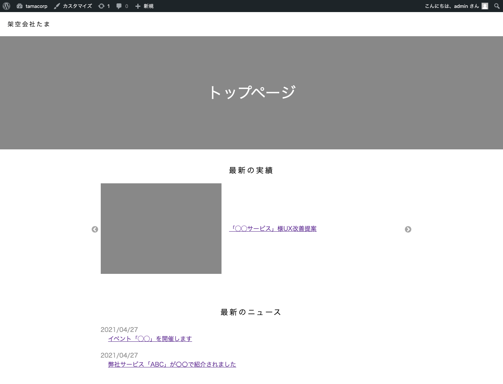

## 全体の目次

本記事では、「FEの目線でWordPressを理解する」という目的で**初学者による初学者向けの解説**を行う。全3回に分けているので、それぞれの内容は下記を参照してほしい。

### 第1回（この記事）

- はじめに
- ローカル環境を用意する
- デフォルトテーマを剥がして無のテーマを作る
- 「固定ページ」と「投稿」と「カスタム投稿タイプ」の解説
- カスタム投稿タイプの作成

### [第2回](../wordpress-introduction2/)

- カスタム投稿タイプごとに「一覧ページ」と「本文ページ」を作る
- 「実績紹介」ページにカスタムフィールド「執筆者」を追加する
- 固定ページを追加する

### [第3回](../wordpress-introduction3/)

- トップページにも「ニュース」と「実績紹介」の一部を表示する
- デフォルトの「投稿」を含む、各種投稿タイプの動作を解説
- お問い合わせフォームを追加する（おまけ）
- 細かい調整と、サイトの完成形の紹介

## はじめに

WordPressは全世界に存在するウェブサイトの**40%**で利用されており、なおも増加し続けているという。もちろん[2021年の話](https://w3techs.com/technologies/history_overview/content_management/all)だ。

近年ではよりミニマルでFEフレンドリーなHeadless CMSなどが登場してはいるものの、プロダクトで利用する場合はやはり圧倒的シェアを誇るWordPressの豊富な情報やプラグインの存在は頼もしいし、「だいたいの要件がWPで実現できる」という信頼と実績もある。

たとえば、コーポレートサイトにおける「投稿による追加が可能な『ニュース記事ページ』」や「お問い合わせフォーム」はWPがあれば難なく作れるだろう。

さらに、エンジニアでなくてもGUIでコンテンツ運用ができる点もメリットだ。運用までエンジニアがやるのであれば、このブログのように「`.md`ファイルをリポジトリに生やせば更新されるぞ」でも別にかまわないのだが。

結論として、依然WordPressが「**Webを仕事にする以上はちょっとくらい触れたほうがなにかと便利**」なツールなのは事実だ。

ところで私はキャリア2年半程度のへっぽこFEなのだが、WordPressには少なからず苦手意識がある。というのも、

- プラグインなどがあり多機能な一方、やりたいことを実現する手段がややこしいイメージ。WPの敷いた巨大なレールに乗ることを強いられそう
- 独特な用語やお作法が多く、覚えるのが面倒そう

という（偏見も含む）イメージがつきまとっているからだ。

しかしつい最近、WPを業務である程度ちゃんと触る必要性に迫られる。この機会にざっくりとWPの使い方について把握しておくことで、「なんとなくニガテ」という身も蓋もない状態から「とりあえずこうやって使えばいいのね」くらいのレベル感に持っていくために執筆したのが今回の記事だ。同じく苦手意識のある方の役に少しでも立てば幸いだ。

## 巷にあふれるWordPressの情報と今回の方針

WordPressについて少し調べるとすぐに気がつくのは、

- 既存のテーマをカスタムしたブログの運用方法など、ノンエンジニア向けの情報が多い。**自分にフィットする情報を探すのに骨が折れる**

ということ。

前提として、FEである私は

- HTMLやCSSを書くことには抵抗がなく、**サイトの骨格は既存テーマ等を使わずスクラッチで実装したい**。
- 過剰にプラグインを導入するくらいなら、PHPのコードを多少書いてカスタムしたほうが手っ取り早いと感じる。
- あえてWPを導入するのは「**コンテンツ管理**」を行いたい（+エンドユーザーに編集用のGUIを提供したい）から、という理由が主。あとはフォーム作成とか。

このような使い方をWPに求めている。そのため、本記事では

- 複数の「**投稿による追加が可能なコンテンツ**」をサイトに組み込む

方法に焦点を当てて解説を行う。話がややこしくなるので、プラグインなどもあまり使わない方針で進めていく（実際には、必要に応じて導入すればよいだろう）。

ちなみに、**WP REST API**については今回は触れない。これはいずれ別の記事で取り上げたい。

### 注意点

- WordPressを用いたECサイトの作り方などの話は今回はしない。
- 初学者の備忘録的な記事のため、**WPにおけるアンチパターンを堂々と掲載している**可能性もある。気付いたタイミングで修正していきたい。

## 成果物の紹介

今回は「コーポレートサイト」の制作を想定して、

- 記事を投稿して追加が可能な「実績紹介」「ニュース」とその一覧ページ
- 「会社概要」など、HTML/CSSで実装した複数の静的ページ
- ごくシンプルな「お問い合わせフォーム」（プラグイン利用）

を組み込んだWebサイトを作成した。サンプルなので申し訳程度だが、スタイリングはすべて自前で行っている。



個人のポートフォリオサイトなどにも転用できる内容だし、WordPress初学者が作るにはちょうどいい課題だと思う。

## ローカル環境の構築

WordPressはPHPの動くサーバー上で稼働する。今回は手っ取り早く[Local](https://localwp.com/)でローカル環境を立てて、そこで作業することにした。

特に設定にこだわりがない場合迷いようがないほど簡単に終わるため、説明は割愛。5秒でいつものダッシュボードが表示される。


ちなみに、WordPressのphpファイル等はローカルに保存されており、Localの画面にリンクがあるためわかりやすい。phpを触るときはここから編集しよう。


設定は初期設定で行ったが、念のため下記に各種バージョンを記載しておく。

|項目名|バージョン|
|-|-|
|Web Server|nginx|
|PHP Version|7.3.5|
|Database|MySQL 8.0.16|
|WordPress|5.7.1|

## デフォルトのテーマを剥がす

WordPressには「テーマ」という概念があり、無料、有料で数多く公開されているテーマを選択するだけでコンテンツを管理するための設定の雛形やスタイルを提供してくれる。ところが、「コーポレートサイトを作る」などオリジナルのデザインありきのコーディングを行う際はこれが不要、**むしろ邪魔**となる。

そこで今回は「WordPressを動かす上で最小の構成要素しかないテーマ」を新たに作成し、まっさらな状態から開発できるようにしてみよう。ここで作成した「無の自作テーマ」に追記していくことで実装を進めるイメージだ。

Localのフォルダから`app/public/wp-content/themes/`にアクセスすると、初期のテーマ3種のフォルダが用意されている。


今回はここに追加で「original」というフォルダを作成し、新規のテーマとした。フォルダ内には

|ファイル名|説明|
|-|-|
|header.php|サイトの共通ヘッダーとして呼び出されるファイル。|
|footer.php|サイトの共通フッターとして呼び出されるファイル。|
|index.php|トップページとして呼び出されるファイル。|
|style.css|基本のCSSファイル。|
|functions.php|WordPressの追加設定を記述するファイル。|

が最低限必要なので作成する。

### header.php

```php
<!DOCTYPE html>
<html lang="ja">
<head>
<meta charset="utf-8">
<title>架空会社たま</title>
<meta name="viewport" content="width=device-width, initial-scale=1" />
<?php wp_head(); ?>
</head>
<body>
<main>
```

### footer.php

```php
</main>
<?php wp_footer(); ?>
</body>
</html>
```

### index.php

```php
<?php get_header() ?>
<h1>トップページ</h1>
<?php get_footer() ?>
```

上記3つのファイルについて順を追って解説していこう。

まず、index.phpの`get_header()`と`get_footer()`は、それぞれheader.phpとfooter.phpの内容を呼び出すWordPressの組み込み関数だ。

これらはトップページ以外のページからも同様の方法で呼び出すことが可能なため、単純に`<header>`タグや`<footer>`タグを挿入するだけではなく、「**サイトの上部と下部に挿入したいサイト共通の記述**」を書く目的で使える。ここでは

- 「DOCTYPE宣言〜`<main>`タグの開始」までをheader.php
- 「`<main>`タグの終了〜`<html>`タグの終了」までをfooter.php

に記載している。

また、`wp_head()`と`wp_footer()`はWPが自動的に諸々のタグを挿入するための関数で、ないと後々困るらしい。おまじないとして入れておけばOKだ。

※devtoolsを見れば、挿入されているタグの詳細が確認できる。かなり容赦なくがっつりと挿入してくるので、不要なものがあればfunctions.phpの設定で調整することもできるようだ。

### style.css

```css
/*
Theme Name: 架空会社たま
*/

/* ここにリセットCSSを記述 */

/* 以下、任意の記述 */
h1 {
  color: red;
}
```

注意点として、冒頭にコメントで`Theme Name`を記載することが必須である。それ以下には、任意の記述を記載してよい。

とりあえず、今回はベタ打ちでリセットCSS（[minireset.css](https://jgthms.com/minireset.css/)）の記述をコピーし、反映されていることがわかりやすいようにh1を赤字にしてみた。

本格的な開発を行う場合は、SCSSなどをコンパイルする環境を用意して「style.css」としてビルドされるようにしてもよいだろう。

### functions.php

本当にただ空のテーマを読み込むだけであればこのファイルはなくてもよいのだが、どうせ絶対に後で作ることになる重要なファイルなので今作っておこう。

WordPressではCSSやJSを読み込む際に、headタグ内で読み込むのではなくfunctions.phpから組み込み関数を利用して読み込むのが推奨されている。まずはそのための記述を書いていこう。

```php
// スタイルシートの読み込み
<?php
function add_files()
{
    wp_enqueue_style('default', get_stylesheet_uri());
}
add_action('wp_enqueue_scripts', 'add_files');

```

怒涛の勢いで出てくる見慣れない文字列はWordPressの組み込み関数である。WordPressのこういうところはちょっと「ウッ」となる部分でもあるのだが、幸い[リファレンス](https://wpdocs.osdn.jp/%E9%96%A2%E6%95%B0%E3%83%AA%E3%83%95%E3%82%A1%E3%83%AC%E3%83%B3%E3%82%B9)は充実しているのでにらめっこしながらがんばって使っていこう。`wp_enqueue_style`の第一引数は一意な識別名のようなもので、被らなければよい。

### 注意点

> 被らなければよい。

と書いているのだが、私は当初

```php
wp_enqueue_style('common', get_stylesheet_uri());
```

という名前にしていたところ**なぜかスタイルが読み込まれなくなる不具合が発生した**。`common`はやめておこう（原因がわからず苦戦した……）。

### テーマを設定する

ファイルを作成すると、ダッシュボードの「テーマ」に自作したものが追加される。


テーマを有効化し、index.phpの内容およびスタイルが反映されていることを確認しよう。


## 最低限の機能とその名前を押さえる

WordPressには「WordPress用語」がけっこうある。慣れればなんてことはないのかもしれないが、初めは少しとっつきづらい。

### 「固定ページ」と「パーマリンク」

まずは、今回実装する要件を振り返ってみよう。

> - HTML/CSSで実装した複数の静的ページ

ひとつめの「複数の静的ページ」は特に記事の追加や更新を行うというわけでなく、単なる1つの独立したページとして配信するものだ。コーポレートサイトでいえば「会社概要」「プライバシーポリシー」などに相当する。

これらをWordPressでは「**固定ページ**」として扱う。ダッシュボードの左側にも「固定ページ」の項目がある。


Localで立てたばかりのサンプルサイトにもプライバシーポリシーなどのサンプルが「固定ページ」として用意されており、各ページのURLは「**パーマリンク**」という名前で設定されている。この「パーマリンク」は他のところでも使われる呼び名なので覚えておこう。

### 「投稿」

一方で、WordPressのCMSとしての機能を利用したブログ記事などは「**投稿**」として管理する。


さて、今回作成するサイトがブログであれば、「なるほど！ここに記事を書いていけばコンテンツが増えていくのか〜」で話は終わりなのだが、今回の要件は

> - 記事を投稿して追加が可能な「実績紹介」「ニュース」とその一覧ページ

であり、「実績紹介」と「ニュース」という**2種類**の投稿画面が必要になる。データの持ち方についても、たとえばコンテンツごとに「サムネイル」「執筆者名」といった追加の項目が必要な場合もあるだろう。

上記のように

- 管理したいコンテンツが2種類以上ある
- コンテンツごとに持ちたい項目が変わる

といった場合には、「カスタム投稿タイプ」や「カスタムフィールド」の作成が必要となる。

### カスタム投稿タイプ、カスタムフィールド、カスタムタクソノミー

ここで似たような用語が3つも同時に出てくるためちょっと混乱する。

詳細な解説は[他サイト](https://kinsta.com/jp/blog/wordpress-custom-post-types/)に譲るが、おおざっぱにいえば

|名前|説明|
|-|-|
|カスタム投稿タイプ|「実績紹介」「ニュース」など、ユーザーが独自に追加できるコンテンツのこと|
|カスタムフィールド|投稿タイプごとに持つデータフィールドを増やしたり削ったりできる機能|
|カスタムタクソノミー|「カテゴリ」「タグ」のように、コンテンツをグループ化するための値を増やしたりできる機能|

という感じ。カスタムフィールドやカスタムタクソノミーは使う必要がないなら無理に使わなくてもよい。WordPressは原則的に **「タイトル」と「本文」** の形でコンテンツを管理するので、それだと過不足があるときに利用しよう。

ちなみに厳密に言うと、WordPressではこれまで紹介した

- 「固定ページ」
- 「（デフォルトで用意されている投稿タイプとしての、狭義の）投稿」
- 「ユーザーが追加したカスタム投稿タイプ」

を全部ひっくるめて「（広義の）投稿」機能として扱う。このそれぞれに対して固有のパーマリンクや、Webページの生成に使うためのphpファイル（後ほど解説する`archive-*.php`や`single-*.php`）が割り当てられていくと考えるとわかりやすいだろうか。

## カスタム投稿タイプを作る

これはあくまで現時点での個人的な見解なのだが、

- デフォルトの「投稿」は**サイトの構成上、そのサイトの中核となるような記事コンテンツがある**のであればそれ用に使う。ないのであれば、すべて『**カスタム投稿タイプ**』として管理してしまう

のがよいのではないかと考えている。

今回はブログのように「投稿型コンテンツがサイトの中核となる」わけではなく、「通常のWebサイトにいくつか投稿型のコンテンツがくっついている」ようなページを作成する。そのためデフォルトの「投稿」はいったん利用せずに、「実績紹介」と「ニュース」をカスタム投稿タイプで管理していくことにする。

詳細な解説はあと（第3回）に回すが、そのほうが**パーマリンクの挙動や作成するファイルの命名が直感的となる**ためだ。

それでは、さっそくカスタム投稿タイプの追加を行いたいのだが、これが

- WordPressの設定ファイル`functions.php`を編集する
- もしくは、外部プラグインを導入して管理画面から追加する

ことしかできない。標準でポチッと管理画面から「追加」できるとよいのだが……とにかく、今回は`functions.php`に追記をしていこう。

```php
// カスタム投稿タイプの作成
function add_post_type()
{
    register_post_type('works', [
        'labels' => [
            'name' => '実績紹介',
        ],
        'public' => true,
        'has_archive' => true,
    ]);

    register_post_type('news', [
        'labels' => [
            'name' => 'ニュース',
        ],
        'public' => true,
        'has_archive' => true,
    ]);
}
add_action('init', 'add_post_type');
```

例によって[リファレンス](http://wpdocs.m.osdn.jp/%E9%96%A2%E6%95%B0%E3%83%AA%E3%83%95%E3%82%A1%E3%83%AC%E3%83%B3%E3%82%B9/register_post_type)を参考に、「実績紹介」「ニュース」のカスタム投稿タイプを設定した。

用意した関数は、`add_action`という関数で実際に実行してあげる必要がある。この`add_action`は今後も何度か登場する。第1引数は「アクションが実行されるタイミングの指定」であることを覚えておこう。

上記の設定値はできるだけ最小限の設定にしているが、どれもけっこう重要なので表にまとめておく。

|設定値|説明|
|-|-|
|register\_post\_typeの第1引数|カスタム投稿タイプのslug。複数形にするとよい。**実際に処理で使われる**ため重要。
|name|管理画面上で表示されるカスタム投稿タイプの名前。
|public|管理画面やフロントエンドから投稿を参照できるようにする。**デフォルトはfalse**。
|has_archive|アーカイブ（記事の一覧ページ）を有効にする。**デフォルトはfalse**。

ダッシュボードを見ると、「実績紹介」「ニュース」の投稿項目が追加されているのがわかる。カスタムフィールドの設定は特に行っていないため、どちらも「タイトル」と「本文」という最も基本的な構成だ。


## おわりに & 次回記事の紹介

続きは[こちら](../wordpress-introduction2/)に掲載している。

次回は作成したカスタム投稿を使って、実際のページを生成する作業などを行っていきたい。
