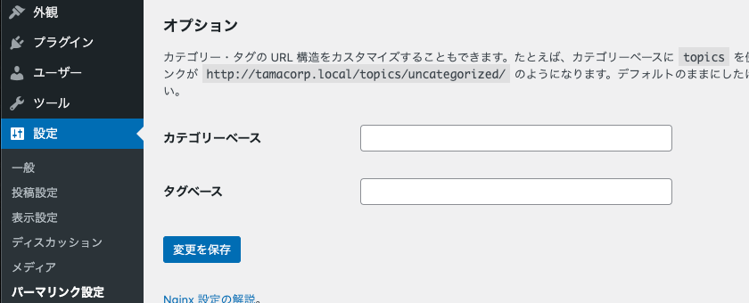

## 全体の目次

この記事は第2回目の記事です。

### [第1回](../wordpress-introduction1/)

- はじめに
- ローカル環境を用意する
- デフォルトテーマを剥がして無のテーマを作る
- 「固定ページ」と「投稿」と「カスタム投稿タイプ」の解説
- カスタム投稿タイプの作成

### 第2回（この記事）

- カスタム投稿タイプごとに「一覧ページ」と「本文ページ」を作る
- 「実績紹介」ページにカスタムフィールド「執筆者」を追加する
- 固定ページを追加する

### [第3回](../wordpress-introduction3/)

- トップページにも「ニュース」と「実績紹介」の一部を表示する
- デフォルトの「投稿」を含む、各種投稿タイプの動作を解説
- お問い合わせフォームを追加する（おまけ）
- 細かい調整と、サイトの完成形の紹介

## 「記事一覧ページ」「本文ページ」の作り方

ここからは、前回の記事で作成したカスタム投稿タイプ「実績紹介」「ニュース」に対して、

- 投稿した記事を一覧表示する「アーカイブ」ページ
- 記事の本文ページ

を作成します。当然ながら、これらはWordPressのデータベースに保存された記事データを**動的に取得してくる**必要があるため、PHPを用いて記述を行うことになります。

WordPressでは、下記のとおり「アーカイブページ」「記事本文ページ」のファイル名があらかじめ定められています。

|ファイル名|説明|
|-|-|
|archive-(slug).php|記事一覧ページ|
|single-(slug).php|記事本文ページ|

上記の`slug`の部分にはカスタム投稿タイプの作成時に設定した値が使われます。今回の場合、

### 実績紹介

- archive-works.php
- single-works.php

### ニュース

- archive-news.php
- single-news.php

という名前にすればOKです。


## 適当な記事を投稿する

まずは読み込みが正常に行われていることを確認するために、「実績紹介」「ニュース」にそれぞれ2つ程度記事を投稿しておきましょう。


## 「ニュース」を作成する

これから「ニュース」のアーカイブページを作成していきます。テーマフォルダ内（index.phpなどと同階層）にファイルを追加しましょう。

### archive-news.php の作成

```php
<?php get_header() ?>
<div>
    <h1><?php the_archive_title(); ?></h1>
    <?php if(have_posts()): ?>
    <ul>
        <?php while(have_posts()):the_post(); ?>
            <li>
                <span><?php the_time('Y/m/d'); ?></span>
                <h2><a href="<?php the_permalink(); ?>"><?php the_title(); ?></a>
            </li>
        <?php endwhile; ?>
    </ul>
    <?php endif; ?>
</div>
<?php get_footer() ?>
```

例によって最小限の記述としています。`while`文を用いて記事の数だけ`<li>`以下を出力しているのがポイントです。PHPの構文はJSに慣れていると少々クセのある書き方にも感じますが、慣れましょう。

それほど難しい内容はありませんが、組み込み関数で取得できる値の内容は下記のとおりです。

|関数名|説明|
|-|-|
|the\_archive\_title()|アーカイブのタイトル。今回の場合は「ニュース」。|
|have_posts()|記事の存在判定。bool値が返る。
|the_post()|ループ中の投稿を「現在の投稿」として設定し、各種の値を利用できる状態にする。おまじないとして覚えておけば問題ない。|
|the_time()|記事の投稿日。引数で表示フォーマットを指定できる。|
|the_permalink()|記事本文ページのパーマリンクURL。|
|the_title()|記事のタイトル。|

### パーマリンクの設定を更新する

archive-(slug).phpを作成すると、`(サイトのドメイン)/(slug)/`というURLでアーカイブページが作成されます。

しかし、WordPressを利用する上で絶対に覚えておきたい点として、「**パーマリンクが追加、変更された際、すぐに設定が反映されないことがある**」ことに注意しましょう。

WordPressはサーバーにパーマリンクのキャッシュを保存しているため、「追加、変更したはずのページにアクセスできない」ということが度々起こります。ちょっと面倒ですが、怪しいと思ったら

- 「ダッシュボード」→「設定」→「パーマリンク設定」で、設定は何も変更せずに「変更を保存」ボタンを押す

という手順でパーマリンクの更新を行ってみましょう。



### アーカイブの表示を確認する

パーマリンクを更新したら、`(サイトのドメイン)/news/`にアクセスしてみましょう。投稿した記事が動的に取得され、リンクが表示されていることがわかります。


### single-news.php の作成

これだけだと、リンクをクリックしても記事の内容は表示されません。続いて、記事の本文を表示するためのphpファイルを作成します。

```php
<?php get_header() ?>
<article>
    <span><?php the_time('Y/m/d'); ?></span>
    <h1><?php the_title(); ?></h1>
    <div>
        <?php the_content(); ?>
    </div>
</article>
<?php get_footer() ?>
```

こちらも記述は最低限としています。

|関数|説明|
|-|-|
|the_content()|記事の本文。|

以上でニュースの本文にアクセスできるようになりました。アーカイブページから記事のリンクをクリックしてみましょう。下記のように記事本文ページが表示されれば成功です。


### 記事本文のパーマリンクを設定する

デフォルトでは記事のパーマリンクは**記事のタイトルと同様**となるため、日本語のタイトルをつけている場合は`(サイトのドメイン)/news/%e5%bc%8a%e7%a4……(省略)/`のように日本語がエンコードされたURLになってしまいます。これだと見た目もわかりづらく、SEO観点でもあまり好ましくないです。

そこで、投稿の編集画面からパーマリンクを変更しましょう。


編集画面上部でパーマリンクを変更し「公開」すると、`(サイトのドメイン)/news/abc/`のように設定したURLで記事にアクセスできます。もし設定がうまく反映されない場合は、先述のパーマリンク設定の更新も試してみましょう。

以上の手順で、「ニュース一覧ページ」「ニュース記事本文ページ」を作成することができました。

## 「実績紹介ページ」にカスタムフィールドを設定する

「実績紹介」の作成も基本的な流れは「ニュース」と同様だが、ここで前回の記事で紹介した「**カスタムフィールド**」を利用して実績紹介に追加の入力欄を用意してみましょう。

例としてはちょっとイマイチかもしれませんが、テキスト欄のみで簡単に実装できるため、今回は記事の「執筆者」が入力できるカスタムフィールドを新たに追加することにします。

まず、現状はWordPressのもっとも基本的なデータ構造となる

- タイトル
- 本文

のみが入力フィールドとして存在しています。


ここに「執筆者」という項目を追加するためには、カスタム投稿タイプと同様に

- functions.phpを編集する
- 外部プラグインを利用する

2つの方法があります。今回は理解を深める目的も兼ねて、前者の方法で進めていきましょう。

### 追記した全内容

```php
// 執筆者のカスタムフィールドを作成する
function insert_author_fields()
{
    global $post;
    $author = get_post_meta($post->ID, 'author', true);
    echo '<input type="text" name="author" value="' . $author . '" />';
}

// 作成したカスタムフィールドを対象の投稿タイプに追加する
function add_custom_fields()
{
    add_meta_box(
        'author_fields',
        '執筆者',
        'insert_author_fields',
        'works',
    );
}

add_action('admin_menu', 'add_custom_fields');

// カスタムフィールドを保存する際に走る処理
function save_custom_fields($post_id)
{
    // 執筆者の追加時に走る処理
    if (isset($_POST['author'])) {
        update_post_meta($post_id, 'author', $_POST['author']);
    }
}

add_action('save_post', 'save_custom_fields');
```

見てのとおり、比較的簡単だったカスタム投稿タイプの追加と比べると少々コードがややこしいです。前提として、カスタムフィールドの追加時には

- カスタムフィールドの「入力欄」そのものを自前で実装する必要がある（そのぶん、慣れれば自由度は高い）
- データ保存時のハンドリングを行う必要がある

という点に注意しましょう。ひとつひとつ解説しますが、カスタムフィールドの追加、編集を頻繁に行う予定がある場合は少々煩雑なので、外部プラグインの利用を検討してもよいと思います。

### 「執筆者」のカスタムフィールドを作成する

```php
function insert_author_fields()
{
    global $post;
    $author = get_post_meta($post->ID, 'author', true);
    echo '<input type="text" name="author" value="' . $author . '" />';
}
```

|関数名|説明|
|-|-|
|get\_post\_meta()|カスタムフィールドの値を取得する。引数の詳細は[リファレンス](https://wpdocs.osdn.jp/%E9%96%A2%E6%95%B0%E3%83%AA%E3%83%95%E3%82%A1%E3%83%AC%E3%83%B3%E3%82%B9/get_post_meta)参照。|

ポイントは`echo`を行っているところで、ここに書いたHTMLが**投稿画面のカスタムフィールド欄に出現します**。今回はinputタグのみのシンプルなものですが、かなり自由度が高いですね。

### 作成したカスタムフィールドを対象の投稿タイプに追加する

```php
function add_custom_fields()
{
    add_meta_box(
        'author_fields',
        '執筆者',
        'insert_author_fields',
        'works',
    );
}

add_action('admin_menu', 'add_custom_fields');
```

|関数名|説明|
|-|-|
|add\_meta\_box()|投稿画面の指定した箇所にメタボックス（枠）を追加する。引数の詳細は[こちら](https://wpdocs.osdn.jp/%E9%96%A2%E6%95%B0%E3%83%AA%E3%83%95%E3%82%A1%E3%83%AC%E3%83%B3%E3%82%B9/add_meta_box)。|

例によって`add_action`で実行することも忘れずに。

### カスタムフィールドを保存する際に走るデータ処理を書く

```php
function save_custom_fields($post_id)
{
    // 執筆者の追加時に走る処理
    if (isset($_POST['author'])) {
        update_post_meta($post_id, 'author', $_POST['author']);
    }
}

add_action('save_post', 'save_custom_fields');
```

最後に、投稿をセーブしたタイミングでフックされる関数として「入力した値を投稿のテーブルに格納する」という処理を行います。

|関数名|説明|
|-|-|
|update\_post\_meta()|指定した投稿のカスタムフィールドの値を更新する。|

今回のようにテキスト欄を追加するだけのフィールドであればそれほど難しくはないのですが、たとえば「画像をアップロードできるカスタムフィールド」などバイナリデータを扱う場合には、

- 画像の実体ファイルをサーバー上に保存する
- 保存した画像ファイルへの参照をテーブルに格納する

といった手順を踏む必要があり少々ややこしいです。

さて、以上の記述をfunctions.phpに記載すると、実績紹介ページの投稿画面にカスタムフィールドが追加されていることが確認できます。適当なテキストを入力し、きちんと値が保存されることもチェックしておきましょう。


## カスタムフィールドの値を呼び出す

それでは、カスタムフィールドの値を実際に呼び出してみましょう。
まずは「ニュース」とまったく同じ要領で

- archive-works.php
- single-works.php

を作成し、single-works.phpに追記を行います。

### single-works.php

```php
<?php get_header() ?>
<article>
    <span><?php the_time('Y/m/d'); ?></span>
    <h1><?php the_title(); ?></h1>
    <div>
        <?php the_content(); ?>
        <small>執筆者: <?php echo get_post_meta($post->ID, 'author', true); ?></small>
    </div>
</article>
<?php get_footer() ?>
```

|関数名|説明|
|-|-|
|get\_post\_meta()|指定した投稿の任意のカスタムフィールドから値を取得する。`echo`しないと出力されない点に注意。リファレンスは[こちら](http://wpdocs.osdn.jp/%E9%96%A2%E6%95%B0%E3%83%AA%E3%83%95%E3%82%A1%E3%83%AC%E3%83%B3%E3%82%B9/get_post_meta)。|

ここでは`get_post_meta`を利用して`author`というキーを持つデータを取得しています。カスタムフィールドが複数ある場合はそれぞれのキーを指定すればよく、わりと直感的な挙動です。

`(サイトのドメイン)/works/(記事のパーマリンク)/`にアクセスすると、正しくカスタムフィールドが取得できていることがわかります。


## 固定ページを追加する

PHPでの動的なデータ取得が必須となる「アーカイブページ」「記事本文ページ」とは異なり、「固定ページ」はHTMLの記述を単純に表示するのみでよいです。

ただし、今回はサイト全体で共通の情報がheader.phpとfooter.phpに記載されているため、

- header.phpの内容とfooter.phpの内容を読み込みつつ、中のコンテンツは「固定ページ」機能で投稿したものをそのまま使う

という方針とします。そのためには固定ページ向けのテンプレートファイルとして、**page.php**というファイルを作成する必要があります。

### page.php

```php
<?php get_header() ?>
<div>
    <?php the_content(); ?>
</div>
<?php get_footer() ?>
```

これだけです。

### 適当な固定ページを投稿し、動作を確認する

動作確認のために、「会社概要」「アクセス」という固定ページを作成してみましょう。初期状態で存在するサンプルの固定ページは削除してもかまいません。

デフォルトのパーマリンクはタイトルと同様になるので、必要に応じてパーマリンクも設定しましょう。


設定したURLにアクセスすると、header.phpとfooter.phpの内容が読み込まれたうえで固定ページが表示されていることがわかります。


もし、サイト内の固定ページがすべてある程度共通のフォーマットを持っているのであれば、page.phpに共通部分を記載し、ページ特有の内容のみを固定ページとして投稿するのもよいと思います。

## おわりに

以上でカスタム投稿タイプや固定ページの表示を行うことができました。最終回となる[次回](../wordpress-introduction3/)では、

- 最新のニュースや実績を、アーカイブページだけでなくサイトトップにも載せる
- 投稿タイプやパーマリンクの挙動について補足

するとともに、フォーム追加やスタイリングなどにも触れていきます！
