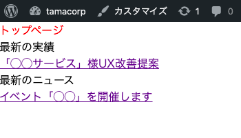
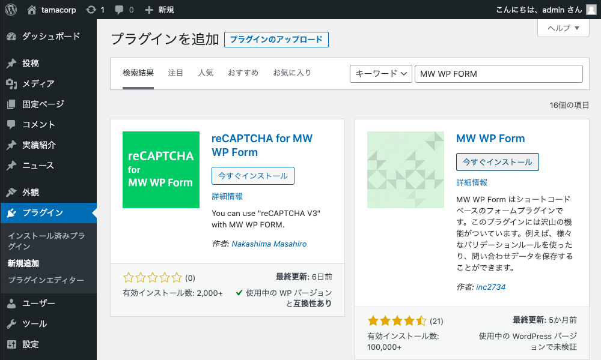
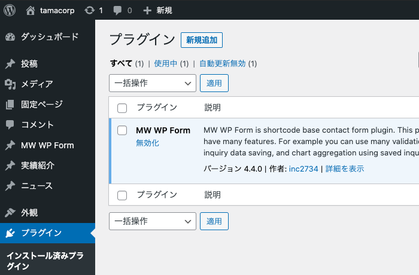
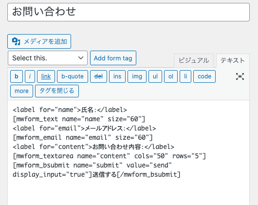
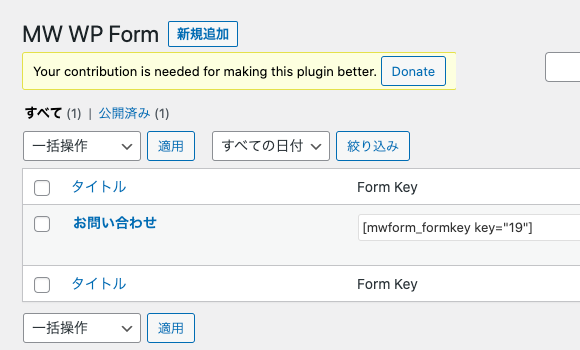
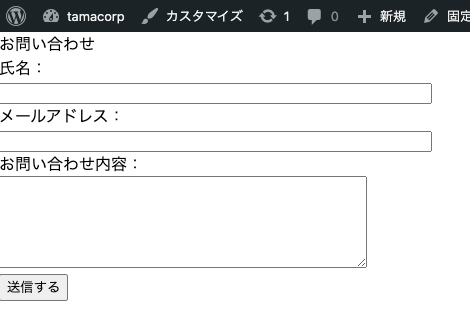

## 全体の目次

この記事は第3回目（最終回）の記事となる。

### [第1回](../wordpress-introduction1/)

- はじめに
- ローカル環境を用意する
- デフォルトテーマを剥がして無のテーマを作る
- 「固定ページ」と「投稿」と「カスタム投稿タイプ」の解説
- カスタム投稿タイプの作成

### [第2回](../wordpress-introduction2/)

- カスタム投稿タイプごとに「一覧ページ」と「本文ページ」を作る
- 「実績紹介」ページにカスタムフィールド「執筆者」を追加する
- 固定ページを追加する

### 第3回（この記事）

- トップページにも「ニュース」と「実績紹介」の一部を表示する
- デフォルトの「投稿」を含む、各種投稿タイプの動作を解説
- お問い合わせフォームを追加する（おまけ）
- 細かい調整と、サイトの完成形の紹介

## トップページにも「ニュース」と「実績紹介」の一部を表示する

現在、ニュースと実績紹介には独立したアーカイブ（記事一覧）ページが存在する。しかし、

- ニュースや実績紹介のうち、最新の何件かはトップページにも記事リンクを表示したい

といったニーズもあるはずだ。そこで、今回はindex.php上で最新記事のタイトルとリンクを表示する作業から進めていく。

### index.php

```php
<?php get_header() ?>
<h1>トップページ</h1>
<h2>最新の実績</h2>
    <?php
    $args = array(
        'numberposts' => 1,
        'post_type' => 'works',
        'order' => 'DESC');
    $works = get_posts($args)
    ?>
    <?php foreach ($works as $post): setup_postdata($post); ?>
        <a href="<?php echo get_permalink($post->ID); ?>">
            <?php echo get_the_title($post->ID); ?>
        </a>
    <?php endforeach; ?>
<h2>最新のニュース</h2>
    <?php
    $args = array(
        'numberposts' => 1,
        'post_type' => 'news',
        'order' => 'DESC');
    $news = get_posts($args)
    ?>
    <?php foreach ($news as $post): setup_postdata($post); ?>
        <a href="<?php echo get_permalink($post->ID); ?>">
            <?php echo get_the_title($post->ID); ?>
        </a>
    <?php endforeach; ?>
<?php get_footer() ?>
```

|関数名|説明|
|-|-|
|get_posts()|引数に渡した設定に従って投稿を取得する。リファレンスは[こちら](https://wpdocs.osdn.jp/%E3%83%86%E3%83%B3%E3%83%97%E3%83%AC%E3%83%BC%E3%83%88%E3%82%BF%E3%82%B0/get_posts)。|
|setup_postdata()|投稿の内容をもとにグローバル変数を宣言する（値を利用できるように準備するイメージ）。おまじないとして覚えておいてもよい。|

今回は最新の1件のみを取得する設定としているが、件数を変更したい場合は`numberposts`に渡す値を変えればよい。これまで書いてきた内容とも類似しているので、直感的に書けるだろう。

トップページの表示は以下のようになる。もちろん、リンクをクリックするとそれぞれの本文ページにジャンプする。



## 各種投稿タイプの動作について

本記事ではこれまで、とりあえず一度納得して進んでいただく形で

> 今回はブログのように「投稿型コンテンツがサイトの中核となる」わけではなく、「通常のWebサイトにいくつか投稿型のコンテンツがくっついている」ようなページを作成する。そのためデフォルトの「投稿」はいったん利用せずに、「実績紹介」と「ニュース」をカスタム投稿タイプで管理していくことにする。

という方針をとって作業を進めてきた。ひととおりのページ作成について解説が完了した今、復習も兼ねて

- デフォルトの「投稿」も含む、各種投稿タイプのパーマリンクやファイル名の動作法則

について解説していきたい。

### パーマリンクの動作

まず、カスタム投稿タイプを利用する場合は基本的に**設定した`slug`に応じてURLが生成**される。今回の「ニュース」でいえば、`/news/`がアーカイブページで、記事本体は`/news/(記事のパーマリンク)`となる。これはわりと素直な挙動だ。

ところがデフォルトの「投稿」の場合はちょっと独特で、

- デフォルトでは**固有のアーカイブページを生成しない**設定になっており、初期テーマでは**トップページ**（index.php）で投稿一覧を取得する仕組みをとっている
- 記事本文のURLは`(サイトのドメイン)/(記事のパーマリンク)`となる

という仕組みになっている。これはブログサイトを想定した場合は違和感のない挙動なのだが、コーポレートサイトなどを制作する際に

- デフォルトの「投稿」で投稿したコンテンツのアーカイブページを**トップページ以外**（たとえば`/blog/`など）に設置したい
- アーカイブと記事本文のURLを同一のslug下（`/blog/（記事のパーマリンク）`が記事のURL）としたい

といった要件を実現する場合、

- functions.phpでURL設定を書き換える
- 固定ページを1枚追加してアーカイブページの代わりとして使い、パーマリンクの設定も調整する

といった多少回りくどい手法を取る必要がある。今回あえてデフォルトの「投稿」を使わなかったのは、そういったややこしさを回避するのが最大の理由だ。

とはいえ、デフォルトの「投稿」が使われずに宙に浮いているのもそれはそれでなんだか気持ち悪い、という方もいるだろう。このアプローチは必ずしも絶対的な正解ではなく、あくまで今回採用した手法にすぎない点には注意してほしい。

### phpのファイル名と読み込みの法則

これまで作成してきたarchive-(slug).phpなどのphpファイルには、命名による**読み込みの優先度**が設定されている。

### アーカイブページの場合

|優先度|ファイル名|
|-|-|
|高|archive-(slug).php
||archive.php
|低|index.php

### 記事本文ページの場合

|優先度|ファイル名|
|-|-|
|高|single-(slug).php
||single.php
|低|index.php

### 固定ページの場合

|優先度|ファイル名|
|-|-|
|高|page-(slug).php
||page.php
|低|index.php

要するに、表示するページに対応する`slug`を明示的に指定しているファイルがある場合はそちらを優先して使い、ない場合は`slug`を含まないファイルを読み込むということだ。

今回の例でいうと **「実績紹介」と「ニュース」の本文ページは同一のテンプレートでかまわない** ならば、わざわざsingle-works.phpやsingle-news.phpを個別に作成せずsingle.phpのみを用意してもよい。

すべてのページの最終的なフォールバックとしてindex.phpの読み込みが設定されているのもポイントで、やろうと思えば「**アーカイブも本文も固定ページもトップページも全部index.php1枚のみで実装する（条件分岐などで出し分ける）**」ということもできなくはない。やる意味はあまりないと思うが……。

（※ちなみに、開発中に「存在するはずのあるページにアクセスしたらなぜかトップページが表示された」という場合には、このフォールバックでindex.phpが表示されていることを疑うとよい。読み込もうとしたファイルの命名ミスなどでうまく読み込めていない可能性がある）

なお、今回は利用しないため説明を省いているのだが**カテゴリ一覧ページ**（特定のカテゴリーやタクソノミーを持つ記事を抽出した一覧ページ）を作成する場合には、「category.php」や「taxonomy.php」が利用できる。こちらも`slug`を指定しているものが優先される、という挙動については同様だ。

## お問い合わせフォームを追加する（おまけ）

さて、ここからはWordPressの最も基本的な機能からは少し外れるのだが、プラグインの導入方法を紹介するついでに実装の機会が多いであろう「**お問い合わせフォーム**」の追加方法をさわりだけ解説する。フォームプラグインにも様々な種類があるので要件に応じた選定が必要だが、今回は「[MW WP FORM](https://ja.wordpress.org/plugins/mw-wp-form/)」という国産で人気の高いプラグインを利用してみる。

### プラグインを追加する

プラグインの追加は管理画面から行える。「プラグイン」→「新規追加」で「MW WP FORM」を検索して、インストールを行う。



インストールしたプラグインは有効化する必要があるので、「インストール済プラグイン」から有効化もしておこう。



導入が完了すると、上記画像のように「カスタム投稿タイプ」と似た配置で「MW WP Form」という項目が追加される。

### フォームを作成する

「MW WP Form」→「新規追加」すると投稿画面が表示される。今回はサンプルとして、

- 氏名（テキストボックス）
- メールアドレス（テキストボックス）
- お問い合わせ内容（テキストエリア）

のフォームを作成しよう。


プラグイン固有の入力欄として、投稿画面の上部に「Select this.」という項目があるのがわかる。ここから作成したい項目を選んで「Add form tag」することで、プラグイン独自のショートコードが作成される（エディタ画面は「ビジュアル」ではなく「テキスト」にしておくとよい）。`<label>`要素は作成されないので、必要に応じて追加しよう。



このあたりはプラグインの使い方の話になってしまうため詳細な解説はここではしないが、バリデーションの設定なども可能だ。

ひとまず上記のようにフォームを作成できたら、「公開」を押して保存しておこう。

### 固定ページにフォームを埋め込む

MW WP Form上でフォームを作成しただけではフォームページなどが新たに用意されるわけでなく、任意の**固定ページ**に対して専用のショートコードを埋め込む必要がある。



MW WP Formの一覧を見ると「Form Key」の欄に埋め込み用のショートコードが用意されているので、こちらをコピーしておこう。

あとは新規に固定ページを作成して、コードを埋め込むだけだ。今回は`contact`というパーマリンクで作成した。




### 送信値の扱いについて

お問い合わせフォームから送信されたデータは、

- WordPressのデータベース上に保存し、管理画面から確認可能にする
- 管理者宛にメールを送信する

ことができる。[マニュアル](https://plugins.2inc.org/mw-wp-form/manual/)が日本語で用意されているので、詳細な設定方法はここから確認しよう。

Webサイト制作において、フォームはフロントエンドのみで実装を完結させることが難しい。`mailto:`で直接メールを送信させることはできなくもないが、あまりUX観点で好ましくはないだろう。

WordPressのプラグインを用いることで、バックエンド処理をほぼ意識することなくフォーム実装が行えるのは大きなメリットだ。

## サイトの完成形の紹介

これまでの作業では一切CSSの調整を行っていなかったので、コーポレートサイトとして最低限見栄えする簡易的なスタイルを付与してみた。

執筆中: 画像追加

### WordPressにおける「スタイリング」や「インタラクション」の実装

これまであえてまったく触れてこなかったのだが、WordPressでは**スタイリングやUIの作成に関して特別な手法などは用意されていない**。

そのため、これまで作成してきたWebサイトにオリジナルのスタイルを当てたいのであれば、通常のHTMLコーディングとまったく同様に

- 要素にクラスなどを当てて、CSSでスタイリングする
- 必要に応じて、JSでインタラクティブなUIを作成する

という手順を取ればよい。たとえば、

- 実績一覧をカルーセルで表示したい

なら、ループ文で書き出されるHTMLの構造を調整したり、JSでカルーセルを作成すればよいだけの話だ。

今回は「FE向け」の解説のためこれらの作成方法については特に触れないが、**WordPressはあくまで「コンテンツのデータ構造づくりと管理、呼び出しのためにカスタマイズする」ものであって、あとは静的なWebサイトと同じように制作を進めればよい**という感覚を持つことでだいぶ取っつきやすくなるのではないだろうか。

### おわりに

当初はちょっとしたTIPS記事程度のボリュームとするつもりだったのだが、最終的には全3回もの連載記事となってしまった。

ここまで進めてきて、第1回の冒頭で触れた

> - 独特な用語やお作法が多く、覚えるのが面倒そう

というイメージは**一側面では事実**という気もしたのだが、それを差し置いてもWordPressは「CMS」としていい意味で枯れており、大抵の疑問や要件に対して先人の用意した解決策やプラグインが存在する安心感については大きな魅力だと感じた。

独自のルールを覚える必要があるのはサービスやフレームワークを利用する以上は絶対に避けては通れない道でもあるので、一度腹を括って取り掛かってみると案外苦手意識を払拭できるかもしれない。

別に組み込み関数名を暗記したりする必要性はないし、リファレンスと触れ合いながら**簡易的なサイトを実際に1から作ってみる**ととても理解が深まるので、おすすめの学習方法だ。

なお、繰り返すが、あくまで本記事は「慌ててWordPressに入門した初学者FE」の目線で記載したものであるため、WPの運用方法としてベストでない記述などもあるかもしれないので要注意だ。

とはいえ、

- テーマの自作を前提としている
- フロントエンドの知識はある程度持っている読者層向け
- プラグインを積極的に採用しない（挙動を知ることを優先する）

という方針でまとまっている記事はあまりない印象だったため、この記事が何かの役に立てば幸いだ。
