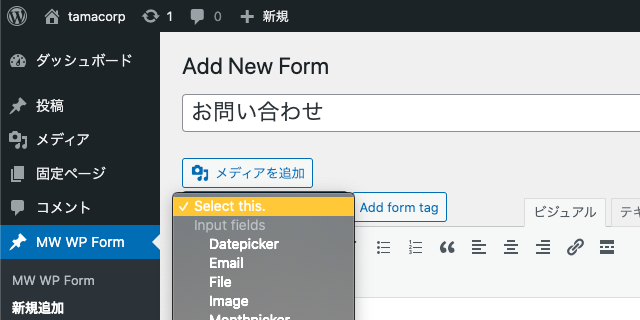
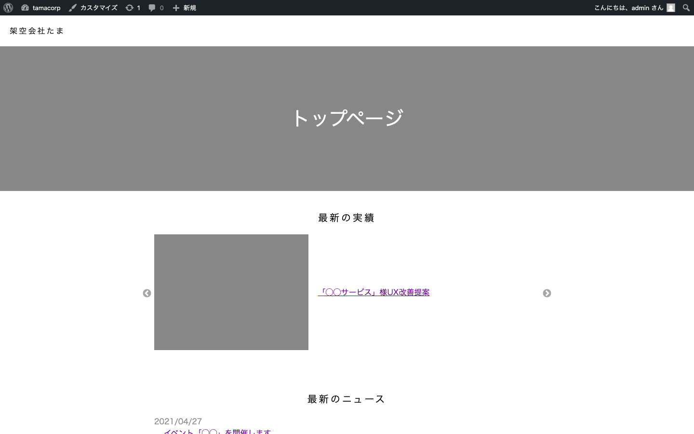

## 全体の目次

この記事は第3回目（最終回）の記事です。

### [第1回](../wordpress-introduction1/)

- はじめに
- ローカル環境を用意する
- デフォルトテーマを剥がして無のテーマを作る
- 「固定ページ」と「投稿」と「カスタム投稿タイプ」の解説
- カスタム投稿タイプの作成

### [第2回](../wordpress-introduction2/)

- カスタム投稿タイプごとに「一覧ページ」と「本文ページ」を作る
- 「実績紹介」ページにカスタムフィールド「執筆者」を追加する
- 固定ページを追加する

### 第3回（この記事）

- トップページにも「ニュース」と「実績紹介」の一部を表示する
- デフォルトの「投稿」を含む、各種投稿タイプの動作を解説
- お問い合わせフォームを追加する（おまけ）
- 細かい調整と、サイトの完成形の紹介

## トップページにも「ニュース」と「実績紹介」の一部を表示する

現在、ニュースと実績紹介には独立したアーカイブ（記事一覧）ページが存在します。しかし、たとえば

- ニュースや実績紹介のうち、最新の何件かはトップページにも記事リンクを表示したい

といったニーズもあるはずです。そこで、今回はindex.php上で最新記事のタイトルとリンクを表示する作業から進めていきましょう。

### index.php

```php
<?php get_header() ?>
<h1>トップページ</h1>
<h2>最新の実績</h2>
    <?php
    $args = array(
        'numberposts' => 1,
        'post_type' => 'works',
        'order' => 'DESC');
    $works = get_posts($args)
    ?>
    <?php foreach ($works as $post): setup_postdata($post); ?>
        <a href="<?php echo get_permalink($post->ID); ?>">
            <?php echo get_the_title($post->ID); ?>
        </a>
    <?php endforeach; ?>
<h2>最新のニュース</h2>
    <?php
    $args = array(
        'numberposts' => 1,
        'post_type' => 'news',
        'order' => 'DESC');
    $news = get_posts($args)
    ?>
    <?php foreach ($news as $post): setup_postdata($post); ?>
        <a href="<?php echo get_permalink($post->ID); ?>">
            <?php echo get_the_title($post->ID); ?>
        </a>
    <?php endforeach; ?>
<?php get_footer() ?>
```

|関数名|説明|
|-|-|
|get_posts()|引数に渡した設定にしたがって投稿を取得する。リファレンスは[こちら](https://wpdocs.osdn.jp/%E3%83%86%E3%83%B3%E3%83%97%E3%83%AC%E3%83%BC%E3%83%88%E3%82%BF%E3%82%B0/get_posts)。|
|setup_postdata()|投稿の内容をもとにグローバル変数を宣言する（値を利用できるように準備するイメージ）。おまじないとして覚えておいてもよい。|

上記では最新の1件のみを取得する設定としていますが、件数を変更したい場合は`numberposts`に渡す値を変えればよいです。これまで書いてきた内容とも類似しているので、直感的に書けると思います。

トップページの表示は以下のようになります。もちろん、リンクをクリックするとそれぞれの本文ページにジャンプします。


## 各種投稿タイプの動作について

本記事ではこれまで、とりあえず一度納得して進んでいただく形で

> 今回はブログのように「投稿型コンテンツがサイトの中核となる」わけではなく、「通常のWebサイトにいくつか投稿型のコンテンツがくっついている」ようなページを作成します。そのためデフォルトの「投稿」はいったん利用せずに、「実績紹介」と「ニュース」をカスタム投稿タイプで管理していくことにします。

という方針をとって作業を進めてきました。ひととおりのページ作成について解説が完了した今、復習も兼ねて

- デフォルトの「投稿」も含む、各種投稿タイプのパーマリンクやファイル名の動作法則

について解説していきます。

### パーマリンクの動作

まず、カスタム投稿タイプを利用する場合は基本的に**設定した`slug`に応じてURLが生成**されます。今回の「ニュース」でいえば、`/news/`がアーカイブページで、記事本体は`/news/(記事のパーマリンク)`となります。これはわりと素直な挙動ですね。

ところがデフォルトの「投稿」の場合はちょっと独特で、

- デフォルトでは**固有のアーカイブページを生成しない**設定になっており、初期テーマでは**トップページ**（index.php）で投稿一覧を取得する仕組みをとっている
- 記事本文のURLは`(サイトのドメイン)/(記事のパーマリンク)`となる

という仕組みです。これはブログサイトを想定した場合は違和感のない挙動ですが、コーポレートサイトなどを制作する際に

- デフォルトの「投稿」で投稿したコンテンツのアーカイブページを**トップページ以外**（たとえば`/blog/`など）に設置したい
- アーカイブと記事本文のURLを同一のslug下（`/blog/（記事のパーマリンク）`が記事のURL）としたい

といった要件を実現する場合、

- functions.phpでURL設定を書き換える
- 固定ページを1枚追加してアーカイブページの代わりとして使い、パーマリンクの設定も調整する

といった多少回りくどい手法を取る必要があります。今回あえてデフォルトの「投稿」を使わなかったのは、そういったややこしさを回避するのが最大の理由です。

とはいえ、デフォルトの「投稿」が使われず宙に浮いているのもそれはそれでなんだか気持ち悪い（運用者に引き渡す際わかりづらい）、という方もいるかもしれません。このアプローチは必ずしも絶対的な正解ではなく、あくまで今回採用した手法にすぎない点には注意してください。

### phpのファイル名と読み込みの法則

これまで作成してきたarchive-(slug).phpなどのphpファイルには、命名による**読み込みの優先度**が設定されています。

### アーカイブページの場合

|優先度|ファイル名|
|-|-|
|高|archive-(slug).php
||archive.php
|低|index.php

### 記事本文ページの場合

|優先度|ファイル名|
|-|-|
|高|single-(slug).php
||single.php
|低|index.php

### 固定ページの場合

|優先度|ファイル名|
|-|-|
|高|page-(slug).php
||page.php
|低|index.php

要するに、表示するページに対応する`slug`を明示的に指定しているファイルがある場合はそちらを優先して使い、ない場合は`slug`を含まないファイルを読み込むということです。

今回の例でいうと **「実績紹介」と「ニュース」の本文ページは同一のテンプレートでかまわない** ならば、わざわざsingle-works.phpやsingle-news.phpを個別に作成せずsingle.phpのみを用意してもよいです。

すべてのページの最終的なフォールバックとしてindex.phpの読み込みが設定されているのもポイントで、やろうと思えば「**アーカイブも本文も固定ページもトップページも全部index.php1枚のみで実装する（条件分岐などで出し分ける）**」ということもできなくはないです。あえてやる意味はなさそうですが……。

（※ちなみに、開発中に「存在するはずのあるページにアクセスしたらなぜかトップページが表示された」という場合には、このフォールバックでindex.phpが表示されていることを疑うとよいです。読み込もうとしたファイルの命名ミスなどでうまく読み込めていない可能性があります）

なお、今回は利用しないため説明を省いているのだが**カテゴリ一覧ページ**（特定のカテゴリーやタクソノミーを持つ記事を抽出した一覧ページ）を作成する場合には、「category.php」や「taxonomy.php」が利用できます。こちらも`slug`を指定しているものが優先される、という挙動については同様です。

## お問い合わせフォームを追加する（おまけ）

さて、ここからはWordPressのもっとも基本的な機能からは少し外れますが、プラグインの導入方法を紹介するついでに「**お問い合わせフォーム**」の追加方法をさわりだけ解説しておきます。フォームプラグインにもさまざまな種類があるので要件に応じた選定が必要ですが、今回は「[MW WP FORM](https://ja.wordpress.org/plugins/mw-wp-form/)」という国産で人気の高いプラグインを利用してみます。

### プラグインを追加する

プラグインの追加は管理画面から行えます。「プラグイン」→「新規追加」で「MW WP FORM」を検索して、インストールを行いましょう。


インストールしたプラグインは有効化する必要があるので、「インストール済プラグイン」から有効化もしておきましょう。


導入が完了すると、上記画像のように「カスタム投稿タイプ」と似た配置で「MW WP Form」という項目が追加されます。

### フォームを作成する

「MW WP Form」→「新規追加」すると投稿画面が表示されます。今回はサンプルとして、

- 氏名（テキストボックス）
- メールアドレス（テキストボックス）
- お問い合わせ内容（テキストエリア）

のフォームを作成しましょう。



プラグイン固有の入力欄として、投稿画面の上部に「Select this.」という項目があります。ここから作成したい項目を選んで「Add form tag」することで、プラグイン独自のショートコードが作成されます（エディター画面は「ビジュアル」ではなく「テキスト」にしておくとよいです）。`<label>`要素は作成されないので、必要に応じて追加しましょう。


このあたりはプラグインの使い方の話になってしまうため詳細な解説はここではしませんが、バリデーションの設定なども可能です。

ひとまず上記のようにフォームを作成できたら、「公開」を押して保存しておきましょう。

### 固定ページにフォームを埋め込む

MW WP Form上でフォームを作成しただけではフォームページなどが新たに用意されるわけでなく、任意の**固定ページ**に対して専用のショートコードを埋め込む必要があります。


MW WP Formの一覧を見ると「Form Key」の欄に埋め込み用のショートコードが用意されているので、こちらをコピーしておきましょう。

あとは新規に固定ページを作成して、コードを埋め込むだけです。今回は`contact`というパーマリンクで作成しました。


### 送信値の扱いについて

お問い合わせフォームから送信されたデータは、

- WordPressのデータベース上に保存し、管理画面から確認可能にする
- 管理者宛にメールを送信する

ことができます。[マニュアル](https://plugins.2inc.org/mw-wp-form/manual/)が日本語で用意されているので、詳細な設定方法はここから確認してください。

Webサイト制作において、フォームはフロントエンドのみで実装を完結させることが難しいです。`mailto:`で直接メールを送信させることはできなくもないですが、現代だとユーザー体験としてちょっと微妙です。

WordPressのプラグインを用いることで、バックエンド処理をほぼ意識することなくフォーム実装が行えるのは大きなメリットですね。

## サイトの完成形を作る

これまでの作業では一切CSSの調整を行っていなかったので、コーポレートサイトとして最低限見栄えする簡易的なスタイルを付与しました（phpファイルのコードについても必要に応じて一部手直しをしています）。



### WordPressにおける「スタイリング」や「インタラクション」の実装

これまであえてまったく触れてこなかったのですが、WordPressでは**スタイリングやUIの作成に関する特別な手法などは用意されていません**。

そのため、これまで作成してきたWebサイトにオリジナルのスタイルを当てたいのであれば、通常のHTMLコーディングとまったく同様に

- 要素にクラスなどを当てて、CSSでスタイリングする
- 必要に応じて、JSでインタラクティブなUIを作成する

という手順を取ればOKです。たとえば、上記の例のように

- 実績一覧をカルーセルで表示する

なら、ループ文で書き出されるHTMLの構造を調整したり、JSでカルーセルを作成すればよいだけです。

今回は「FE向け」の解説のためこれらの作成方法については触れませんが、**WordPressはあくまで「コンテンツのデータ構造づくりと管理、呼び出しのためにカスタマイズする」ものであって、あとは静的なWebサイトと同じように制作を進めればよい**という感覚を持つとだいぶ取っつきやすくなると思います！

### おわりに

当初はちょっとしたTIPS記事程度のボリュームとするつもりでしたが、最終的には全3回もの連載記事となってしまいました。

ここまで進めてきて、第1回の冒頭で触れた

> - 独特な用語やお作法が多く、覚えるのが面倒そう

というイメージは**ぶっちゃけ事実**という気もしましたが、それを差し置いてもWordPressは「CMS」としていい意味で枯れており、大抵の疑問や要件に対して先人の用意した解決策やプラグインが存在する安心感については大きな魅力だと感じます。

独自のルールを覚える必要があるのはサービスやフレームワークを利用する以上は絶対に避けては通れない道でもあるので、一度腹を括って取り掛かってみると案外苦手意識を払拭できるかもしれません。

組み込み関数名を丸暗記したりする必要はありませんし、リファレンスと触れ合いながら**簡易的なサイトを実際に1から作ってみる**ととても理解が深まるので、オススメの学習方法です。

なお繰り返しとなりますが、あくまで本記事は「慌ててWordPressに入門した初学者FE」の目線で記載したものであるため、WPの運用方法としてベストでない記述などもあるかもしれないので注意してください。

とはいえ、

- テーマの自作を前提としている
- フロントエンドの知識はある程度持っている読者層向け
- プラグインを積極的に採用しない（挙動を知ることを優先する）

という方針でまとまっている記事はあまり多くないと思いますので、この記事が何かの役に立てば幸いです！
